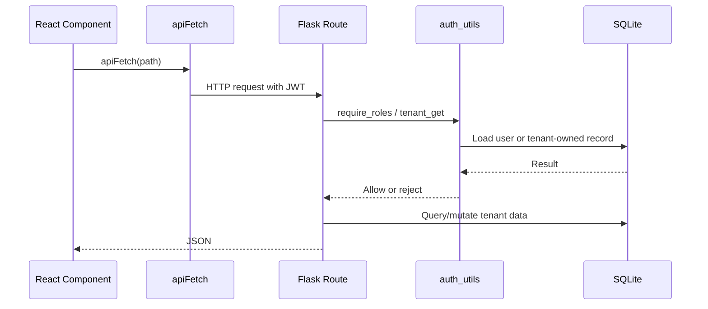

# API Documentation

Last reviewed: 2026-05-16

This document inventories the current REST and Socket.IO API surfaces. Payload examples are minimal and inferred from current frontend/backend usage.

## API Conventions

- Base REST URL: `/api`
- Frontend REST helper: `frontend/src/lib/api.js`
- Auth header: `Authorization: Bearer <JWT>`
- Response format: JSON objects/lists
- Error format: usually `{ "error": "..." }`, but not fully standardized
- API versioning: none

## Public REST Endpoints

| Method | Path | Purpose |
| --- | --- | --- |
| GET | `/api/ping` | Health check |
| POST | `/api/auth/register-hospital` | Create hospital tenant and admin user |
| POST | `/api/auth/register` | Create patient account |
| POST | `/api/auth/login` | Login and issue JWT |

## Protected Auth/User Endpoints

| Method | Path | Roles | Purpose |
| --- | --- | --- | --- |
| GET | `/api/auth/doctors` | authenticated | Available doctors in current tenant |
| GET | `/api/auth/doctors/all` | authenticated | Active doctors, including unavailable |
| GET | `/api/auth/admin/users` | admin, doctor, superadmin | Users visible to role |
| POST | `/api/auth/admin/users` | admin, superadmin | Create staff/doctor/admin user |
| PUT | `/api/auth/admin/users/<user_id>` | admin, superadmin | Update user |
| PUT | `/api/auth/admin/users/<user_id>/deactivate` | admin, superadmin | Toggle active status |

## Protected Patient Endpoints

| Method | Path | Roles | Purpose |
| --- | --- | --- | --- |
| GET | `/api/patients/<patient_id>/appointments` | patient, admin, staff, doctor, superadmin | Patient appointments |
| GET | `/api/patients/<patient_id>/prescriptions` | patient, admin, staff, doctor, superadmin | Patient prescriptions |
| PUT | `/api/patients/<patient_id>/profile` | patient, admin, superadmin | Update patient profile |

Patient role is restricted to its own `patient_id`.

## Protected Hospital Endpoints

| Method | Path | Roles | Purpose |
| --- | --- | --- | --- |
| GET | `/api/hospital/admin/analytics` | admin, superadmin | Tenant analytics |
| GET | `/api/hospital/queue` | staff, admin, superadmin | Staff queue |
| GET | `/api/hospital/doctor/<doc_id>/queue` | doctor, admin, superadmin | Doctor queue |
| GET | `/api/hospital/doctor/<doc_id>/stats` | doctor, admin, superadmin | Doctor stats |
| GET | `/api/hospital/lab/queue` | staff, admin, superadmin | Lab queue |
| GET | `/api/hospital/patient/<patient_id>/tests` | patient, staff, doctor, admin, superadmin | Patient lab tests |
| GET | `/api/hospital/pharmacy/queue` | staff, admin, superadmin | Pharmacy queue |
| POST | `/api/hospital/rating` | patient, admin, superadmin | Submit rating |
| PUT | `/api/hospital/doctor/<doc_id>/availability` | doctor, admin, superadmin | Toggle doctor availability |
| GET | `/api/hospital/doctor/<doc_id>/slots?date=YYYY-MM-DD` | authenticated roles | Available slots |
| PUT | `/api/hospital/appointment/<appt_id>/notes` | doctor, admin, superadmin | Save clinical notes |
| GET | `/api/hospital/appointment/<appt_id>/notes` | doctor, admin, superadmin | Read clinical notes |
| PUT | `/api/hospital/appointment/<appt_id>/reschedule` | patient, staff, admin, superadmin | Reschedule appointment |
| POST | `/api/hospital/appointment/<appt_id>/invoice` | admin, staff, doctor, superadmin | Generate invoice |
| GET | `/api/hospital/patient/<patient_id>/invoices` | patient, staff, admin, superadmin | Patient invoices |
| PUT | `/api/hospital/invoice/<inv_id>/pay` | patient, staff, admin, superadmin | Mark invoice paid |
| GET | `/api/hospital/appointment/<appt_id>/summary` | patient, doctor, admin, staff, superadmin | Visit summary |
| GET | `/api/hospital/admin/search` | admin, superadmin | Search users/appointments |

## Socket.IO Events

Socket connection:

- URL: `VITE_SOCKET_URL`
- Client sends `auth: { token }`
- Server decodes JWT, stores socket context, joins `hospital:<hospital_id>` room

### Client Emits

| Event | Roles | Purpose |
| --- | --- | --- |
| `action_book_appointment` | patient | Create appointment and initial invoice |
| `action_arrive` | patient, staff, admin | Mark appointment arrived |
| `action_cancel_appointment` | patient, staff, admin | Cancel scheduled appointment |
| `action_submit_vitals` | staff, admin | Save vitals and update status |
| `action_prescribe_test` | doctor, admin | Order lab test |
| `action_pay_test` | patient, staff, admin | Mark lab test paid |
| `action_upload_test_report` | staff, admin | Complete lab result |
| `action_prescribe_meds` | doctor, admin | Create prescription and complete visit |
| `action_dispense_meds` | staff, admin | Mark prescription dispensed |

### Server Emits

| Event | Purpose |
| --- | --- |
| `appointment_booked` | Notifies tenant dashboards that a new appointment exists |
| `queue_updated` | Notifies tenant dashboards to refresh queue/workflow data |
| `auth_error` | Socket action authorization failure |
| `action_error` | Socket action domain failure |

## Request Lifecycle

## API Weaknesses

| Issue | Severity | Affected Modules | Probable Impact | Incremental Improvement | Difficulty |
| --- | --- | --- | --- | --- | --- |
| No versioning | Medium | all clients/routes | Breaking changes are hard to manage | Add `/api/v1` when API stabilizes | Medium |
| No schema validation | High | all POST/PUT/socket payloads | Bad payloads can produce runtime errors | Add request schema validation | Medium |
| Inconsistent error handling | Medium | all routes | Frontend has to guess error shape | Standardize error response helper | Low |
| Socket events carry mutable domain actions | High | `app.py` | Hard to test and audit | Move to service functions + tests | Medium |
| No rate limiting | Medium | auth and public endpoints | Abuse/bruteforce risk | Add rate limiting | Low |

