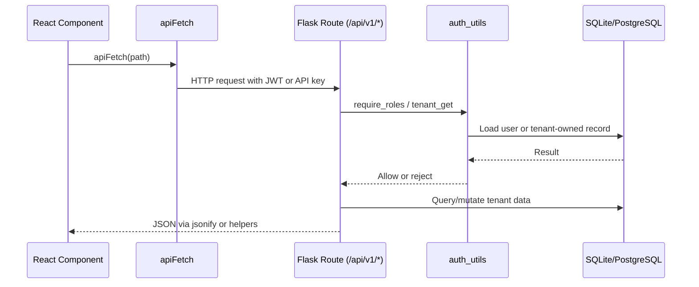

# API Documentation

Last reviewed: 2026-06-19

This document inventories the current REST and Socket.IO API surfaces.

## API Conventions

- Base REST URL: `/api/v1`
- Frontend REST helper: `frontend/src/lib/api.ts` (`apiFetch`)
- Auth header: `Authorization: Bearer <JWT>` (or raw API key via `Authorization: Bearer <key>`)
- API key header: `Authorization: Bearer <pk_*>` — API keys are scoped and tenant-bound, created via the admin API key endpoints
- Response format: JSON objects/lists — all endpoints use `jsonify()` (Flask standard) or the `error_response()` / `success_response()` helpers in `validation.py`
- Error format: `{ "error": "...", "code": <http_status> }` via `error_response()`, or plain `{ "error": "..." }` on legacy routes — not fully standardized
- API versioning: active via `/api/v1/` prefix (`API_PREFIX` config). Legacy `/api/` routes issue HTTP 301 redirects to `/api/v1/`. Config-driven via `API_PREFIX` env var.
- Request ID: auto-generated if missing, propagated in `X-Request-ID` response header

## Version Endpoint

| Method | Path | Purpose |
| --- | --- | --- |
| GET | `/api/version` | Returns current API version and build metadata |

Response (200):
```json
{
  "version": "1.0.0",
  "api_prefix": "/api/v1"
}
```

## Public REST Endpoints

| Method | Path | Purpose |
| --- | --- | --- |
| GET | `/api/v1/ping` | Health check |
| GET | `/api/v1/health` | Health status with database connectivity check |
| POST | `/api/v1/auth/register-hospital` | Create hospital tenant and admin user (rate: 3/hr, password policy enforced) |
| POST | `/api/v1/auth/register` | Create patient account (rate: 5/hr, password policy enforced) |
| POST | `/api/v1/auth/login` | Login and issue JWT + refresh token (rate: 20/min) |

## Protected Auth/User Endpoints

| Method | Path | Roles | Purpose |
| --- | --- | --- | --- |
| GET | `/api/v1/auth/doctors` | authenticated | Available doctors in current tenant (paginated) |
| GET | `/api/v1/auth/doctors/all` | authenticated | Active doctors, including unavailable (paginated) |
| GET | `/api/v1/auth/admin/users` | admin, doctor, superadmin | Users visible to role (paginated) |
| POST | `/api/v1/auth/admin/users` | admin, superadmin | Create staff/doctor/admin user |
| PUT | `/api/v1/auth/admin/users/<user_id>` | admin, superadmin | Update user |
| PUT | `/api/v1/auth/admin/users/<user_id>/deactivate` | admin, superadmin | Toggle active status |
| POST | `/api/v1/auth/refresh` | authenticated (refresh) | Refresh access + refresh token pair (rotation) |
| POST | `/api/v1/auth/logout` | authenticated (refresh) | Revoke current refresh token |
| GET | `/api/v1/auth/me` | authenticated | Get current user profile |
| PUT | `/api/v1/auth/change-password` | authenticated | Change password (revokes all refresh tokens) |

### API Key Management (`/api/v1/auth/admin/api-keys`)

| Method | Path | Roles | Purpose |
| --- | --- | --- | --- |
| POST | `/api/v1/auth/admin/api-keys` | admin, superadmin | Create API key |
| GET | `/api/v1/auth/admin/api-keys` | admin, superadmin | List API keys |
| PUT | `/api/v1/auth/admin/api-keys/<key_id>` | admin, superadmin | Update API key (name, scopes, is_active) |
| DELETE | `/api/v1/auth/admin/api-keys/<key_id>` | admin, superadmin | Revoke/delete API key |

**POST `/api/v1/auth/admin/api-keys`**

Request body:
```json
{
  "name": "CI/CD Integration",
  "scopes": ["read:patients"],
  "expires_in_days": 90
}
```

Response (201):
```json
{
  "message": "API key created",
  "api_key": {
    "id": 1,
    "name": "CI/CD Integration",
    "raw_key": "pk_Z8z...",
    "key_prefix": "pk_Z8z",
    "scopes": ["read:patients"],
    "expires_at": "2026-09-17T12:00:00"
  }
}
```

Errors:
- `400`: Missing name, invalid expires_in_days (must be 1–365)

**GET `/api/v1/auth/admin/api-keys`**

Response (200):
```json
{
  "api_keys": [
    {
      "id": 1,
      "name": "CI/CD Integration",
      "key_prefix": "pk_Z8z",
      "scopes": ["read:patients"],
      "is_active": true,
      "last_used_at": "2026-06-19T10:00:00",
      "expires_at": "2026-09-17T12:00:00",
      "created_at": "2026-06-19T12:00:00"
    }
  ]
}
```

**DELETE `/api/v1/auth/admin/api-keys/<key_id>`**

Response (200):
```json
{ "message": "API key deleted" }
```

Errors:
- `404`: API key not found

### Webhook Management (`/api/v1/auth/admin/webhooks`)

| Method | Path | Roles | Purpose |
| --- | --- | --- | --- |
| POST | `/api/v1/auth/admin/webhooks` | admin, superadmin | Create webhook endpoint |
| GET | `/api/v1/auth/admin/webhooks` | admin, superadmin | List webhooks |
| PUT | `/api/v1/auth/admin/webhooks/<wh_id>` | admin, superadmin | Update webhook |
| DELETE | `/api/v1/auth/admin/webhooks/<wh_id>` | admin, superadmin | Delete webhook |
| GET | `/api/v1/auth/admin/webhooks/events` | public (no auth) | List valid webhook event types |
| GET | `/api/v1/auth/admin/webhooks/<wh_id>/deliveries` | admin, superadmin | List webhook delivery attempts (last 50) |
| POST | `/api/v1/auth/admin/webhooks/test` | admin, superadmin | Dispatch a test event |

**POST `/api/v1/auth/admin/webhooks`**

Request body:
```json
{
  "name": "Slack Notifier",
  "url": "https://hooks.slack.com/...",
  "events": ["appointment.created", "payment.received"],
  "retry_count": 3,
  "timeout_seconds": 10,
  "is_active": true
}
```

Response (201):
```json
{
  "message": "Webhook created",
  "webhook": {
    "id": 1,
    "name": "Slack Notifier",
    "url": "https://hooks.slack.com/...",
    "events": ["appointment.created", "payment.received"],
    "secret": "abc123...",
    "is_active": true
  }
}
```

Errors:
- `400`: Missing name/url/events, unknown event type

**GET `/api/v1/auth/admin/webhooks/events`**

Response (200):
```json
{
  "events": [
    "appointment.created",
    "appointment.updated",
    "appointment.cancelled",
    "lab.requested",
    "lab.completed",
    "prescription.issued",
    "prescription.dispensed",
    "payment.received",
    "patient.registered",
    "invoice.generated"
  ]
}
```

Valid events: `appointment.created`, `appointment.updated`, `appointment.cancelled`, `lab.requested`, `lab.completed`, `prescription.issued`, `prescription.dispensed`, `payment.received`, `patient.registered`, `invoice.generated`.

### Admin Usage Endpoints

| Method | Path | Roles | Purpose |
| --- | --- | --- | --- |
| GET | `/api/v1/admin/usage` | admin, superadmin | Historical usage from AuditLog (7–90 day window) |
| GET | `/api/v1/admin/usage/live` | authenticated | Live usage from in-memory tracker (per-tenant or platform-wide for superadmin) |

**GET `/api/v1/admin/usage?days=7`**

Response (200):
```json
{
  "hospital_id": 1,
  "period_days": 7,
  "total_requests": 142,
  "by_action": {
    "pay_invoice": 12,
    "create_user": 3
  },
  "by_resource": {
    "invoice": 12,
    "user": 3
  },
  "by_day": {
    "2026-06-12": 20,
    "2026-06-13": 35
  }
}
```

For superadmin, response also includes `hospitals` array with per-hospital totals.

**GET `/api/v1/admin/usage/live`**

Response (200):
```json
{
  "hospital_id": 1,
  "total": 42,
  "endpoints": {
    "auth.login": 10,
    "hospital.queue": 32
  }
}
```

Errors:
- `400`: hospital_id required

## Protected Patient Endpoints

| Method | Path | Roles | Purpose |
| --- | --- | --- | --- |
| GET | `/api/v1/patients/<patient_id>/appointments` | patient, admin, staff, doctor, superadmin | Patient appointments |
| GET | `/api/v1/patients/<patient_id>/prescriptions` | patient, admin, staff, doctor, superadmin | Patient prescriptions |
| PUT | `/api/v1/patients/<patient_id>/profile` | patient, admin, superadmin | Update patient profile |

Patient role is restricted to its own `patient_id`.

## Protected Hospital Endpoints

| Method | Path | Roles | Purpose |
| --- | --- | --- | --- |
| GET | `/api/v1/hospital/admin/analytics` | admin, superadmin | Tenant analytics (real revenue from paid invoices, cached 30s) |
| GET | `/api/v1/hospital/queue` | staff, admin, superadmin | Staff queue (paginated) |
| GET | `/api/v1/hospital/doctor/<doc_id>/queue` | doctor, admin, superadmin | Doctor queue (paginated) |
| GET | `/api/v1/hospital/doctor/<doc_id>/stats` | doctor, admin, superadmin | Doctor stats |
| GET | `/api/v1/hospital/lab/queue` | staff, admin, superadmin | Lab queue (paginated) |
| GET | `/api/v1/hospital/patient/<patient_id>/tests` | patient, staff, doctor, admin, superadmin | Patient lab tests (paginated) |
| GET | `/api/v1/hospital/pharmacy/queue` | staff, admin, superadmin | Pharmacy queue (paginated) |
| POST | `/api/v1/hospital/rating` | patient, admin, superadmin | Submit rating |
| PUT | `/api/v1/hospital/doctor/<doc_id>/availability` | doctor, admin, superadmin | Toggle doctor availability |
| GET | `/api/v1/hospital/doctor/<doc_id>/slots?date=YYYY-MM-DD` | authenticated roles | Available slots |
| PUT | `/api/v1/hospital/appointment/<appt_id>/notes` | doctor, admin, superadmin | Save clinical notes |
| GET | `/api/v1/hospital/appointment/<appt_id>/notes` | doctor, admin, superadmin | Read clinical notes |
| PUT | `/api/v1/hospital/appointment/<appt_id>/reschedule` | patient, staff, admin, superadmin | Reschedule appointment |
| POST | `/api/v1/hospital/appointment/<appt_id>/invoice` | admin, staff, doctor, superadmin | Generate invoice |
| GET | `/api/v1/hospital/patient/<patient_id>/invoices` | patient, staff, admin, superadmin | Patient invoices (paginated) |
| PUT | `/api/v1/hospital/invoice/<inv_id>/pay` | patient, staff, admin, superadmin | Mark invoice paid (cash, creates Payment record, emits payment_processed) |
| GET | `/api/v1/hospital/appointment/<appt_id>/summary` | patient, doctor, admin, staff, superadmin | Visit summary |
| GET | `/api/v1/hospital/admin/search` | admin, superadmin | Search users/appointments (paginated) |
| POST | `/api/v1/hospital/lab/upload` | staff, doctor, admin | Upload lab report file (multipart/form-data, rate: 10/min per tenant) |
| GET | `/api/v1/hospital/lab/documents/<doc_id>` | authenticated | Download lab report |
| GET | `/api/v1/hospital/lab/test/<test_id>/documents` | authenticated | List lab documents |

### Payment Endpoint Details

**PUT `/api/v1/hospital/invoice/<inv_id>/pay`**

Request body:
```json
{
  "method": "cash"
}
```

Response (200):
```json
{
  "message": "Invoice paid",
  "payment_id": 1,
  "transaction_id": "TXN1718479200150001"
}
```

Errors:
- `404`: Invoice not found
- `409`: Invoice already paid

Side effects:
- Creates `Payment` record with auto-generated `transaction_id`
- Updates `Invoice.status` to `Paid`
- Audit logs via `log_action()` with amount, payment_id, transaction_id, method
- Emits `payment_processed` socket event to tenant room
- Enqueues `generate_invoice_pdf` Celery task

### Stripe Payment Endpoints

| Method | Path | Roles | Purpose |
| --- | --- | --- | --- |
| POST | `/api/v1/hospital/invoice/<inv_id>/create-payment-intent` | patient, staff, admin, superadmin | Create Stripe PaymentIntent |
| POST | `/api/v1/hospital/invoice/<inv_id>/confirm-online-payment` | patient, staff, admin, superadmin | Confirm online payment |

**POST `/api/v1/hospital/invoice/<inv_id>/create-payment-intent`**

No request body required.

Response (200):
```json
{
  "client_secret": "pi_3..._secret_...",
  "payment_intent_id": "pi_3...",
  "amount": 5000,
  "publishable_key": "pk_test_..."
}
```

Errors:
- `404`: Invoice not found
- `409`: Invoice already paid
- `500`: Stripe API error

Returns mock values when `STRIPE_SECRET_KEY` is not configured.

**POST `/api/v1/hospital/invoice/<inv_id>/confirm-online-payment`**

Request body:
```json
{
  "payment_intent_id": "pi_3..."
}
```

Response (200):
```json
{
  "message": "Online payment confirmed",
  "payment_id": 1
}
```

Errors:
- `404`: Invoice not found
- `409`: Invoice already paid
- `400`: Payment not successful
- `500`: Stripe retrieve error

Side effects (same as cash pay):
- Creates `Payment` record with method `online`
- Audit logs with action `pay_invoice_online`
- Emits `payment_processed` socket event
- Enqueues `generate_invoice_pdf` Celery task

### Telemedicine Endpoints

| Method | Path | Roles | Purpose |
| --- | --- | --- | --- |
| POST | `/api/v1/hospital/telemedicine/rooms` | doctor, admin, superadmin | Create teleconsultation room |
| GET | `/api/v1/hospital/telemedicine/rooms` | patient, doctor, admin, superadmin | List rooms (filtered by role, supports `?status=` filter) |
| POST | `/api/v1/hospital/telemedicine/rooms/<room_id>/start` | doctor, admin | Start consultation |
| POST | `/api/v1/hospital/telemedicine/rooms/<room_id>/end` | doctor, admin | End consultation |
| PUT | `/api/v1/hospital/telemedicine/rooms/<room_id>/notes` | doctor, admin | Update consultation notes |

**POST `/api/v1/hospital/telemedicine/rooms`**

Request body:
```json
{
  "appointment_id": 1,
  "patient_id": 1,
  "scheduled_at": "2026-06-20T14:00:00",
  "provider": "jitsi"
}
```

Response (201):
```json
{
  "message": "Teleconsultation room created",
  "teleconsultation": {
    "id": 1,
    "room_name": "pulse-abc123...",
    "provider": "jitsi",
    "status": "scheduled",
    "meeting_url": "https://meet.jit.si/pulse-abc123...",
    "scheduled_at": "2026-06-20T14:00:00"
  }
}
```

If room for `appointment_id` already exists, returns 200 with existing room data.

Errors:
- `400`: Missing appointment_id or patient_id

**GET `/api/v1/hospital/telemedicine/rooms?status=scheduled`**

Response (200):
```json
{
  "teleconsultations": [
    {
      "id": 1,
      "appointment_id": 1,
      "room_name": "pulse-abc123...",
      "provider": "jitsi",
      "status": "scheduled",
      "meeting_url": "https://meet.jit.si/pulse-abc123...",
      "scheduled_at": "2026-06-20T14:00:00",
      "started_at": null,
      "ended_at": null
    }
  ]
}
```

Role filtering: doctors see only their own rooms, patients see their own rooms, admins see all in tenant.

### FHIR Endpoints

| Method | Path | Roles | Purpose |
| --- | --- | --- | --- |
| POST | `/api/v1/hospital/fhir/observations` | admin, staff, superadmin | Ingest FHIR Observation bundle |
| GET | `/api/v1/hospital/fhir/metadata` | public (no auth) | FHIR CapabilityStatement |

**POST `/api/v1/hospital/fhir/observations`**

Request body (FHIR Bundle):
```json
{
  "resourceType": "Bundle",
  "type": "collection",
  "patient_id": 1,
  "appointment_id": 1,
  "entry": [
    {
      "resource": {
        "resourceType": "Observation",
        "code": {
          "coding": [{"system": "http://loinc.org", "code": "8867-4", "display": "Heart rate"}]
        },
        "valueQuantity": {
          "value": 72,
          "unit": "bpm"
        }
      }
    }
  ]
}
```

Response (201):
```json
{
  "message": "1 lab test(s) created",
  "lab_tests": [
    {"id": 1, "test_name": "Heart rate", "status": "Completed"}
  ]
}
```

Errors:
- `400`: Not a Bundle resource, no Observation resources found, missing patient_id

**GET `/api/v1/hospital/fhir/metadata`**

Response (200):
```json
{
  "resourceType": "CapabilityStatement",
  "status": "active",
  "date": "2026-06-19",
  "publisher": "Pulse HMS",
  "kind": "instance",
  "fhirVersion": "4.0.1",
  "acceptUnknown": "no",
  "format": ["json"],
  "rest": [
    {
      "mode": "server",
      "resource": [
        {
          "type": "Observation",
          "profile": ["http://hl7.org/fhir/StructureDefinition/Observation"],
          "interaction": [{"code": "create"}, {"code": "search-type"}]
        }
      ]
    }
  ]
}
```

### Document Upload Endpoints

**POST `/api/v1/hospital/lab/upload`**

Multipart form data fields:
- `file` — the uploaded file (allowed: pdf, png, jpg, jpeg, doc, docx; max 16 MB)
- `patient_id` — integer, required
- `lab_test_id` — integer, required
- `description` — optional

Rate limit: 10 per minute per tenant.

Response (201):
```json
{
  "document": {
    "id": 1,
    "original_name": "blood_report.pdf",
    "file_size": 123456,
    "content_type": "application/pdf",
    "uploaded_at": "2026-06-19T12:00:00"
  }
}
```

Errors:
- `400`: Missing fields, file too large, file type not allowed, no file
- `404`: Lab test not found

Side effect: Sets lab test status to `Completed`.

**GET `/api/v1/hospital/lab/documents/<doc_id>`**

Downloads the file. Sets `Content-Disposition: attachment` with the original filename.

Errors:
- `404`: Document not found or file missing on disk
- `403`: Cross-tenant access or patient accessing another patient's document

**GET `/api/v1/hospital/lab/test/<test_id>/documents`**

Response (200):
```json
{
  "documents": [
    {
      "id": 1,
      "original_name": "blood_report.pdf",
      "file_size": 123456,
      "content_type": "application/pdf",
      "uploaded_at": "2026-06-19T12:00:00"
    }
  ]
}
```

Errors:
- `404`: Lab test not found

## Superadmin REST Endpoints

All superadmin endpoints require `role == "superadmin"`.

| Method | Path | Purpose |
| --- | --- | --- |
| GET | `/api/v1/superadmin/stats` | Platform-wide statistics (hospitals, users, appointments, revenue, cached 60s) |
| GET | `/api/v1/superadmin/hospitals` | List all hospitals with stats (users, appointments, revenue, paginated) |
| GET | `/api/v1/superadmin/hospitals/<id>` | Single hospital detail with feature_flags |
| POST | `/api/v1/superadmin/hospitals` | Create a new hospital with admin account (password policy enforced) |
| PUT | `/api/v1/superadmin/hospitals/<id>` | Update hospital (name, subdomain, plan, is_active) |
| GET | `/api/v1/superadmin/hospitals/<id>/users` | List all users in a hospital (paginated) |

Plan change triggers automatic `feature_flags` update. Available plans: `trial`, `basic`, `pro`, `enterprise`.

## Feature Flags by Plan

| Feature | trial | basic | pro | enterprise |
| --- | --- | --- | --- | --- |
| Max users | 10 | 50 | 200 | 1000 |
| Max doctors | 3 | 10 | 50 | 200 |
| Analytics | No | Yes | Yes | Yes |
| Billing module | No | Yes | Yes | Yes |
| Export data | No | No | Yes | Yes |
| Custom branding | No | No | Yes | Yes |
| API access | No | No | No | Yes |

## Socket.IO Events

Socket connection:
- URL: `VITE_SOCKET_URL`
- Client sends `auth: { token }` in the connection handshake
- Server decodes JWT, stores socket context in `services.socket_sessions`, joins `hospital:<hospital_id>` room

### Client Emits

| Event | Roles | Purpose |
| --- | --- | --- |
| `action_book_appointment` | patient | Create appointment and initial invoice |
| `action_arrive` | patient, staff, admin | Mark appointment arrived |
| `action_cancel_appointment` | patient, staff, admin | Cancel scheduled appointment |
| `action_submit_vitals` | staff, admin | Save vitals and update status |
| `action_prescribe_test` | doctor, admin | Order lab test |
| `action_pay_test` | patient, staff, admin | Mark lab test paid |
| `action_upload_test_report` | staff, admin | Complete lab result |
| `action_prescribe_meds` | doctor, admin | Create prescription and complete visit |
| `action_dispense_meds` | staff, admin | Mark prescription dispensed |

### Server Emits

| Event | Purpose |
| --- | --- |
| `appointment_booked` | Notifies tenant dashboards that a new appointment exists |
| `queue_updated` | Notifies tenant dashboards to refresh queue/workflow data |
| `payment_processed` | Notifies tenant dashboards that an invoice was paid (AdminDashboard refreshes analytics) |
| `auth_error` | Socket action authorization failure |
| `action_error` | Socket action domain failure |

### Socket.IO Handler Modules

Events are handled in `backend/services/`:

| Module | Handlers |
| --- | --- |
| `services/appointment.py` | `action_book_appointment`, `action_arrive`, `action_cancel_appointment` |
| `services/vitals.py` | `action_submit_vitals` |
| `services/lab.py` | `action_prescribe_test`, `action_pay_test`, `action_upload_test_report` |
| `services/pharmacy.py` | `action_prescribe_meds`, `action_dispense_meds` |

### Socket Session Management

- `services/__init__.py` maintains `socket_sessions` dict mapping `request.sid` to user context.
- `require_socket_roles()` decorator validates role before handler execution.
- `socket_payload()` extracts and validates required fields from event payloads.
- `tenant_appointment()` loads appointment scoped to the user's tenant.

## Request Lifecycle



All requests hit versioned `/api/v1/` routes. Legacy `/api/` paths issue 301 redirects.

## Audit Logging

Audit records are created via `backend/audit.py` `log_action()`.

Standard audit payload:
```json
{
  "hospital_id": 1,
  "user_id": 1,
  "action": "pay_invoice",
  "resource_type": "invoice",
  "resource_id": 1,
  "details": {
    "amount": 500.0,
    "payment_id": 1,
    "transaction_id": "TXN1718479200150001",
    "method": "cash"
  }
}
```

Audited actions:
- `pay_invoice` — includes amount, payment_id, transaction_id, method in details
- `pay_invoice_online` — same fields, method = "online"
- `create_user` — includes role, name in details
- `update_user` — includes changed fields in details
- `deactivate_user` — includes is_active in details
- `create_hospital` — includes name, plan, admin in details
- `update_hospital` — includes changed fields in details
- `create_api_key` — includes name, scopes, expires_in_days in details
- `revoke_api_key` — includes key_id, name in details
- `create_webhook` — includes name, url, events in details
- `delete_webhook` — includes webhook_id, name in details
- `update_webhook` — includes changed fields in details
- `create_telemedicine_room` — includes appointment_id, patient_id, provider in details
- `upload_lab_report` — includes filename, file_size in details

## Rate Limiting

Rate limits are enforced on public auth endpoints to prevent abuse:

| Endpoint | Limit | Scope |
| --- | --- | --- |
| `POST /api/v1/auth/login` | 20 per minute | IP address |
| `POST /api/v1/auth/register` | 5 per hour | IP address |
| `POST /api/v1/auth/register-hospital` | 3 per hour | IP address |
| `POST /api/v1/hospital/lab/upload` | 10 per minute | Per-tenant |
| All other routes | 200 per day, 50 per hour | IP address (default) |

Blueprint-level per-tenant rate limits (enforced via `limiter.limit()` in `app.py`):

| Blueprint | Limit | Key |
| --- | --- | --- |
| `auth_bp` | 100 per minute | Tenant ID |
| `hospital_bp` | 100 per minute | Tenant ID |
| `patient_bp` | 100 per minute | Tenant ID |
| `superadmin_bp` | 60 per minute | Tenant ID |

Rate limiting is configurable via `RATELIMIT_ENABLED`, `RATELIMIT_DEFAULT` env vars. Disabled in test environment. Uses in-memory storage by default (Redis recommended for production).

## Security Headers

All API responses include:

| Header | Value | Purpose |
| --- | --- | --- |
| `X-Content-Type-Options` | `nosniff` | Prevent MIME type sniffing |
| `X-Frame-Options` | `DENY` | Prevent clickjacking |
| `X-XSS-Protection` | `0` | Disable legacy XSS auditor |
| `Strict-Transport-Security` | `max-age=31536000; includeSubDomains` | HSTS |
| `Cache-Control` | `no-store` | Prevent caching of sensitive responses |
| `X-Response-Time` | `0.123s` | Request duration |

## Password Policy

All user-facing password fields are validated against:

- Minimum 8 characters
- At least one uppercase letter (A-Z)
- At least one lowercase letter (a-z)
- At least one digit (0-9)
- At least one special character (`!@#$%^&*(),.?":{}|<>_-`)

Enforced on: register, register-hospital, change-password. Admin user creation with default password `changeme` bypasses validation.

## API Weaknesses

| Issue | Severity | Affected Modules | Probable Impact | Incremental Improvement | Difficulty |
| --- | --- | --- | --- | --- | --- |
| ~~No versioning~~ | ~~Medium~~ | ~~all clients/routes~~ | ~~Breaking changes are hard to manage~~ | ~~Add `/api/v1` when API stabilizes~~ | ~~Medium~~ |
| No schema validation | High | all POST/PUT/socket payloads | Bad payloads can produce runtime errors | Add request schema validation | Medium |
| Inconsistent error handling | Medium | all routes | Frontend has to guess error shape | Standardize error response helper | Low |
| ~~Socket events carry mutable domain actions~~ | ~~High~~ | ~~services/ modules~~ | ~~Hard to test and audit~~ | ~~Moved to service functions + tests~~ | ~~Medium~~ |
| ~~No rate limiting~~ | ~~Medium~~ | ~~auth and public endpoints~~ | ~~Abuse/bruteforce risk~~ | ~~Add rate limiting~~ | ~~Low~~ |
