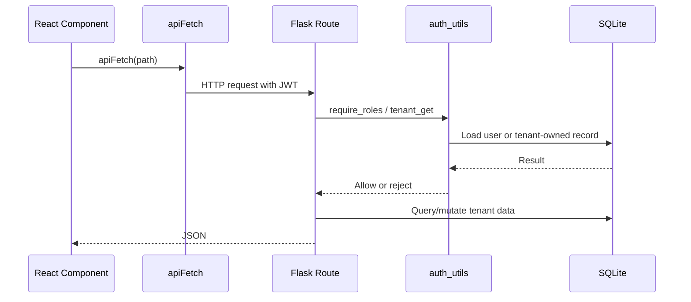

# API Documentation

Last reviewed: 2026-06-15

This document inventories the current REST and Socket.IO API surfaces.

## API Conventions

- Base REST URL: `/api`
- Frontend REST helper: `frontend/src/lib/api.js` (`apiFetch`)
- Auth header: `Authorization: Bearer <JWT>`
- Response format: JSON objects/lists
- Error format: usually `{ "error": "..." }`, not fully standardized
- API versioning: none
- Request ID: auto-generated if missing, propagated in `X-Request-ID` response header

## Public REST Endpoints

| Method | Path | Purpose |
| --- | --- | --- |
| GET | `/api/ping` | Health check |
| GET | `/api/health` | Health status with database connectivity check |
| POST | `/api/auth/register-hospital` | Create hospital tenant and admin user (rate: 3/hr, password policy enforced) |
| POST | `/api/auth/register` | Create patient account (rate: 5/hr, password policy enforced) |
| POST | `/api/auth/login` | Login and issue JWT + refresh token (rate: 20/min) |

## Protected Auth/User Endpoints

| Method | Path | Roles | Purpose |
| --- | --- | --- | --- |
| GET | `/api/auth/doctors` | authenticated | Available doctors in current tenant |
| GET | `/api/auth/doctors/all` | authenticated | Active doctors, including unavailable |
| GET | `/api/auth/admin/users` | admin, doctor, superadmin | Users visible to role |
| POST | `/api/auth/admin/users` | admin, superadmin | Create staff/doctor/admin user |
| PUT | `/api/auth/admin/users/<user_id>` | admin, superadmin | Update user |
| PUT | `/api/auth/admin/users/<user_id>/deactivate` | admin, superadmin | Toggle active status |
| POST | `/api/auth/refresh` | authenticated (refresh) | Refresh access + refresh token pair (rotation) |
| POST | `/api/auth/logout` | authenticated (refresh) | Revoke current refresh token |
| GET | `/api/auth/me` | authenticated | Get current user profile |
| PUT | `/api/auth/change-password` | authenticated | Change password (revokes all refresh tokens) |

## Protected Patient Endpoints

| Method | Path | Roles | Purpose |
| --- | --- | --- | --- |
| GET | `/api/patients/<patient_id>/appointments` | patient, admin, staff, doctor, superadmin | Patient appointments |
| GET | `/api/patients/<patient_id>/prescriptions` | patient, admin, staff, doctor, superadmin | Patient prescriptions |
| PUT | `/api/patients/<patient_id>/profile` | patient, admin, superadmin | Update patient profile |

Patient role is restricted to its own `patient_id`.

## Protected Hospital Endpoints

| Method | Path | Roles | Purpose |
| --- | --- | --- | --- |
| GET | `/api/hospital/admin/analytics` | admin, superadmin | Tenant analytics (real revenue from paid invoices) |
| GET | `/api/hospital/queue` | staff, admin, superadmin | Staff queue |
| GET | `/api/hospital/doctor/<doc_id>/queue` | doctor, admin, superadmin | Doctor queue |
| GET | `/api/hospital/doctor/<doc_id>/stats` | doctor, admin, superadmin | Doctor stats |
| GET | `/api/hospital/lab/queue` | staff, admin, superadmin | Lab queue |
| GET | `/api/hospital/patient/<patient_id>/tests` | patient, staff, doctor, admin, superadmin | Patient lab tests |
| GET | `/api/hospital/pharmacy/queue` | staff, admin, superadmin | Pharmacy queue |
| POST | `/api/hospital/rating` | patient, admin, superadmin | Submit rating |
| PUT | `/api/hospital/doctor/<doc_id>/availability` | doctor, admin, superadmin | Toggle doctor availability |
| GET | `/api/hospital/doctor/<doc_id>/slots?date=YYYY-MM-DD` | authenticated roles | Available slots |
| PUT | `/api/hospital/appointment/<appt_id>/notes` | doctor, admin, superadmin | Save clinical notes |
| GET | `/api/hospital/appointment/<appt_id>/notes` | doctor, admin, superadmin | Read clinical notes |
| PUT | `/api/hospital/appointment/<appt_id>/reschedule` | patient, staff, admin, superadmin | Reschedule appointment |
| POST | `/api/hospital/appointment/<appt_id>/invoice` | admin, staff, doctor, superadmin | Generate invoice |
| GET | `/api/hospital/patient/<patient_id>/invoices` | patient, staff, admin, superadmin | Patient invoices |
| PUT | `/api/hospital/invoice/<inv_id>/pay` | patient, staff, admin, superadmin | Mark invoice paid (creates Payment record, emits payment_processed) |
| GET | `/api/hospital/appointment/<appt_id>/summary` | patient, doctor, admin, staff, superadmin | Visit summary |
| GET | `/api/hospital/admin/search` | admin, superadmin | Search users/appointments |

### Payment Endpoint Details

**PUT `/api/hospital/invoice/<inv_id>/pay`**

Request body:
```json
{
  "method": "cash"
}
```

Response (200):
```json
{
  "success": true,
  "message": "Invoice paid successfully",
  "payment_id": 1,
  "transaction_id": "TXN1718479200150001"
}
```

Errors:
- `404`: Invoice not found
- `409`: Invoice already paid

Side effects:
- Creates `Payment` record with auto-generated `transaction_id`
- Updates `Invoice.status` to `Paid`
- Audit logs via `log_action()` with amount, payment_id, transaction_id, method
- Emits `payment_processed` socket event to tenant room

## Socket.IO Events

Socket connection:
- URL: `VITE_SOCKET_URL`
- Client sends `auth: { token }` in the connection handshake
- Server decodes JWT, stores socket context in `services.socket_sessions`, joins `hospital:<hospital_id>` room

### Client Emits

| Event | Roles | Purpose |
| --- | --- | --- |
| `action_book_appointment` | patient | Create appointment and initial invoice |
| `action_arrive` | patient, staff, admin | Mark appointment arrived |
| `action_cancel_appointment` | patient, staff, admin | Cancel scheduled appointment |
| `action_submit_vitals` | staff, admin | Save vitals and update status |
| `action_prescribe_test` | doctor, admin | Order lab test |
| `action_pay_test` | patient, staff, admin | Mark lab test paid |
| `action_upload_test_report` | staff, admin | Complete lab result |
| `action_prescribe_meds` | doctor, admin | Create prescription and complete visit |
| `action_dispense_meds` | staff, admin | Mark prescription dispensed |

### Server Emits

| Event | Purpose |
| --- | --- |
| `appointment_booked` | Notifies tenant dashboards that a new appointment exists |
| `queue_updated` | Notifies tenant dashboards to refresh queue/workflow data |
| `payment_processed` | Notifies tenant dashboards that an invoice was paid (AdminDashboard refreshes analytics) |
| `auth_error` | Socket action authorization failure |
| `action_error` | Socket action domain failure |

### Socket.IO Handler Modules

Events are handled in `backend/services/`:

| Module | Handlers |
| --- | --- |
| `services/appointment.py` | `action_book_appointment`, `action_arrive`, `action_cancel_appointment` |
| `services/vitals.py` | `action_submit_vitals` |
| `services/lab.py` | `action_prescribe_test`, `action_pay_test`, `action_upload_test_report` |
| `services/pharmacy.py` | `action_prescribe_meds`, `action_dispense_meds` |

### Socket Session Management

- `services/__init__.py` maintains `socket_sessions` dict mapping `request.sid` to user context.
- `require_socket_roles()` decorator validates role before handler execution.
- `socket_payload()` extracts and validates required fields from event payloads.
- `tenant_appointment()` loads appointment scoped to the user's tenant.

## Request Lifecycle



## Audit Logging

Audit records are created via `backend/audit.py` `log_action()`.

Standard audit payload:
```json
{
  "hospital_id": 1,
  "user_id": 1,
  "action": "pay_invoice",
  "resource_type": "invoice",
  "resource_id": 1,
  "details": {
    "amount": 500.0,
    "payment_id": 1,
    "transaction_id": "TXN1718479200150001",
    "method": "cash"
  }
}
```

Audited actions:
- `pay_invoice` — includes amount, payment_id, transaction_id, method in details

## Rate Limiting

Rate limits are enforced on public auth endpoints to prevent abuse:

| Endpoint | Limit | Scope |
| --- | --- | --- |
| `POST /api/auth/login` | 20 per minute | IP address |
| `POST /api/auth/register` | 5 per hour | IP address |
| `POST /api/auth/register-hospital` | 3 per hour | IP address |
| All other routes | 200 per day, 50 per hour | IP address (default) |

Rate limiting is configurable via `RATELIMIT_ENABLED`, `RATELIMIT_DEFAULT` env vars. Disabled in test environment. Uses in-memory storage by default (Redis recommended for production).

## Security Headers

All API responses include:

| Header | Value | Purpose |
| --- | --- | --- |
| `X-Content-Type-Options` | `nosniff` | Prevent MIME type sniffing |
| `X-Frame-Options` | `DENY` | Prevent clickjacking |
| `X-XSS-Protection` | `0` | Disable legacy XSS auditor |
| `Strict-Transport-Security` | `max-age=31536000; includeSubDomains` | HSTS |
| `Cache-Control` | `no-store` | Prevent caching of sensitive responses |

## Password Policy

All user-facing password fields are validated against:

- Minimum 8 characters
- At least one uppercase letter (A-Z)
- At least one lowercase letter (a-z)
- At least one digit (0-9)
- At least one special character (`!@#$%^&*(),.?":{}|<>_-`)

Enforced on: register, register-hospital, change-password. Admin user creation with default password `changeme` bypasses validation.

## API Weaknesses

| Issue | Severity | Affected Modules | Probable Impact | Incremental Improvement | Difficulty |
| --- | --- | --- | --- | --- | --- |
| No versioning | Medium | all clients/routes | Breaking changes are hard to manage | Add `/api/v1` when API stabilizes | Medium |
| No schema validation | High | all POST/PUT/socket payloads | Bad payloads can produce runtime errors | Add request schema validation | Medium |
| Inconsistent error handling | Medium | all routes | Frontend has to guess error shape | Standardize error response helper | Low |
| ~~Socket events carry mutable domain actions~~ | ~~High~~ | ~~services/ modules~~ | ~~Hard to test and audit~~ | ~~Moved to service functions + tests~~ | ~~Medium~~ |
| No rate limiting | Medium | auth and public endpoints | Abuse/bruteforce risk | Add rate limiting | Low |
