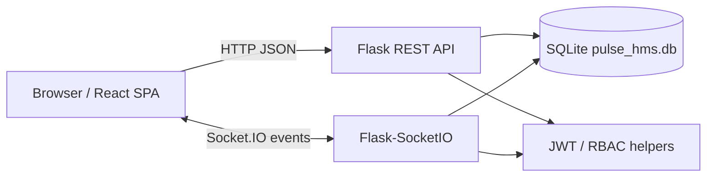
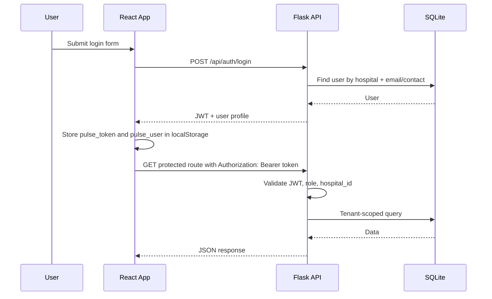
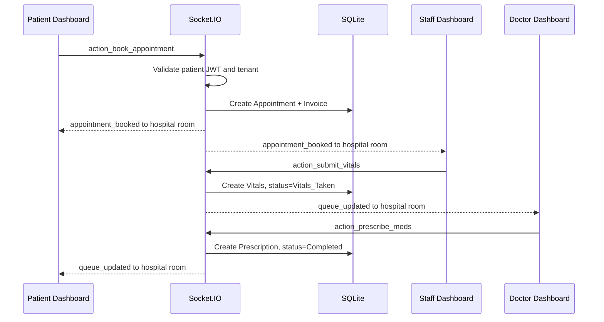
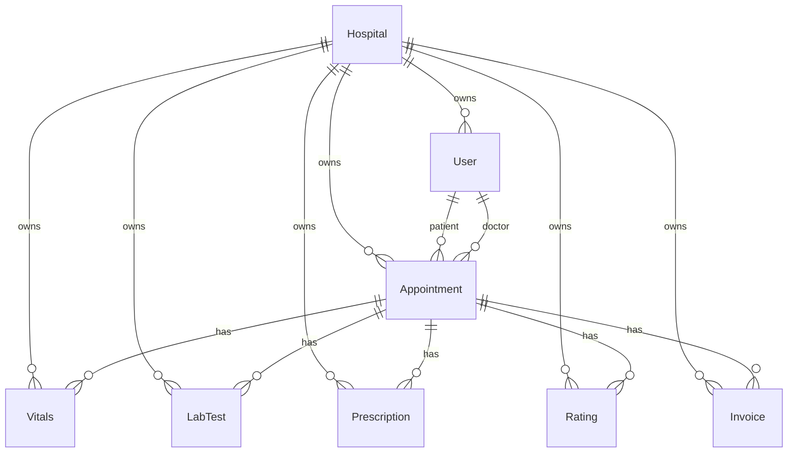
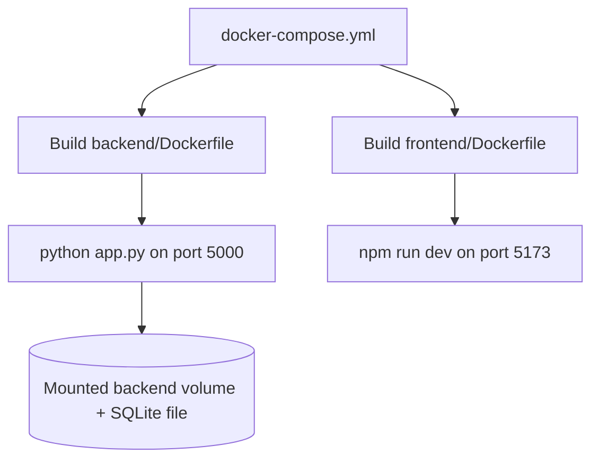

# Pulse HMS Architecture

Last reviewed: 2026-05-16

This document describes the architecture that exists in the current implementation. It does not describe a target architecture unless explicitly marked as an improvement.

## System Design

Pulse HMS is a multi-role hospital management prototype with a React frontend, Flask backend, SQLite database, and Socket.IO real-time event channel.



Current runtime components:

- `frontend/`: React + Vite single-page app.
- `backend/`: Flask API, Flask-SocketIO server, SQLAlchemy models.
- `backend/pulse_hms.db`: SQLite database used by the local app.
- `docker-compose.yml`: development-oriented backend and frontend services.
- `old_vanilla_version/`: legacy implementation, not part of the current React/Flask runtime.

## Folder Structure

```text
pulse-hms-platform/
  backend/
    app.py                 # Flask app, Socket.IO handlers, blueprint registration
    auth_routes.py         # Auth, doctor listing, admin user routes
    auth_utils.py          # JWT, role, tenant helper functions
    hospital_routes.py     # Hospital operations, queues, billing, summaries
    patient_routes.py      # Patient appointment/prescription/profile endpoints
    models.py              # SQLAlchemy models
    seed.py                # Local seed/reset script
    requirements.txt       # Python dependencies
    Dockerfile             # Backend image
    .env.example           # Backend env sample
  frontend/
    src/
      App.jsx              # Router and providers
      components/          # Role dashboards and public pages
      context/             # Auth, notification, socket providers
      lib/api.js           # API and socket URL config + authenticated fetch
    package.json
    Dockerfile
    .env.example
  docs/
    SAAS_DEVELOPMENT_GUIDE.md
    architecture.md
    backend.md
    frontend.md
  docker-compose.yml
  SETUP_GUIDE.md
```

## Service Boundaries

### Frontend Boundary

The frontend owns:

- Route selection and client-side role guarding.
- Local authentication state in `localStorage`.
- Dashboard UI for patient, doctor, staff, admin, and superadmin roles.
- REST calls through `frontend/src/lib/api.js`.
- Socket connection setup through `SocketContext`.
- PDF generation using `jspdf`.

The frontend does not own authoritative authorization. It hides or redirects UI, but backend routes and socket handlers enforce access.

### Backend Boundary

The backend owns:

- JWT issuance and verification.
- Role and tenant checks.
- Database writes and reads.
- Appointment workflow state transitions.
- Real-time queue events.
- Billing and invoice status.
- Doctor, staff, patient, and admin API responses.

### Database Boundary

The current database is a single SQLite database with shared tables. Tenant ownership is represented by `hospital_id` on tenant-owned models.

## Data Flow

### Login And Authenticated REST Flow



### Appointment Queue Flow



## API Layers

The backend exposes REST API groups:

- `/api/auth/*`: hospital registration, patient registration, login, doctors, admin users.
- `/api/patients/*`: patient appointments, prescriptions, profile update.
- `/api/hospital/*`: queues, analytics, tests, pharmacy, ratings, availability, slots, notes, invoices, summaries, search.
- `/api/ping`: simple health check.

Socket.IO events exist for workflow mutations:

- `action_book_appointment`
- `action_arrive`
- `action_cancel_appointment`
- `action_submit_vitals`
- `action_prescribe_test`
- `action_pay_test`
- `action_upload_test_report`
- `action_prescribe_meds`
- `action_dispense_meds`

## Caching, Workers, And Integrations

Current implementation:

- Caching layer: none.
- Async job/worker system: none.
- External payment integration: none.
- External email/SMS integration: none.
- External object/file storage integration: none.
- Monitoring/observability integration: none.

Socket.IO is used for real-time workflow events, but it is not a background job system.

## Authentication Flow

Current auth uses JWTs from `flask-jwt-extended`.

- Tokens are created in `auth_routes.py`.
- Token identity is the user id as a string.
- Additional claims contain `role` and `hospital_id`.
- Frontend stores token in `localStorage` as `pulse_token`.
- `apiFetch` attaches the token to REST calls.
- `SocketContext` sends the token in the Socket.IO `auth` payload.
- `auth_utils.py` centralizes role and tenant helper functions.

Current roles:

- `patient`
- `doctor`
- `staff`
- `admin`
- `superadmin`

## State Management

There is no Redux or server-state library. State management is component-local plus React Context.

Current contexts:

- `AuthContext`: stores `user`, `token`, `login`, and `logout`.
- `NotificationContext`: exposes notification helpers.
- `SocketContext`: creates one Socket.IO connection when a user is logged in.

Dashboard data is fetched and stored in local `useState` hooks inside each dashboard component.

## Database Relationships

The models are defined in `backend/models.py`.



SQLAlchemy models currently define foreign keys but not full relationship properties. Most route code fetches related rows manually with `User.query.get(...)`, `Appointment.query.get(...)`, or filtered queries.

## Important Patterns

- Tenant isolation is implemented by filtering records by `hospital_id`.
- Role authorization is implemented with `@require_roles(...)`.
- Public auth routes are intentionally unauthenticated.
- REST calls are centralized through `apiFetch`.
- Socket events are authorized using a per-socket session map in `backend/app.py`.
- Real-time events are emitted to tenant rooms named `hospital:<hospital_id>`.
- The app uses `db.create_all()` only when `AUTO_CREATE_TABLES=true`.
- Seed data is upserted by `backend/seed.py`; destructive local resets require `python seed.py --reset`.

## Environment Variables

Backend:

| Variable | Current Use |
| --- | --- |
| `SECRET_KEY` | Flask secret key, default `pulse-dev-secret` |
| `JWT_SECRET_KEY` | JWT signing key, default `pulse-dev-jwt-secret` |
| `DATABASE_URL` | SQLAlchemy database URI, default local SQLite |
| `CORS_ORIGINS` | Comma-separated allowed frontend origins, default `http://localhost:5173` |
| `FLASK_ENV` | Set in Docker Compose, not deeply used by the app |

Frontend:

| Variable | Current Use |
| --- | --- |
| `VITE_API_URL` | Base REST API URL, default `http://localhost:5000/api` |
| `VITE_SOCKET_URL` | Socket.IO URL, default derived from `VITE_API_URL` |

## Deployment Flow

The current deployment setup is development-oriented.



Current Docker Compose:

- Builds backend from `backend/`.
- Mounts `./backend:/app`.
- Runs `python app.py`.
- Builds frontend from `frontend/`.
- Runs Vite dev server with `--host 0.0.0.0`.

This is useful for local development, not production deployment.

## Testing And CI/CD

Current implementation:

- Backend test suite: none found.
- Frontend test suite: none found.
- CI/CD workflow: none found.
- Available validation: backend Python compile, frontend build, frontend lint.

## Architectural Weaknesses

Canonical detailed list: `docs/architectural-weaknesses.md`.

Highest-impact current weaknesses:

- No automated tests.
- No migrations.
- SQLite active database.
- Socket workflow logic coupled to `app.py`.
- Large frontend dashboard components.
- No audit logs.
- Development-only Docker/runtime.
- Superadmin dashboard uses mock data.

## Suggested Improvements

These are recommendations only; they are not implemented in this documentation pass.

- Add Flask-Migrate/Alembic and remove `db.create_all()` from startup.
- Move production database to PostgreSQL.
- Split Socket.IO handlers into a dedicated module.
- Add service-layer functions for appointment, billing, lab, and prescription workflows.
- Add SQLAlchemy relationships and indexes.
- Add tests for tenant isolation, role authorization, and workflow transitions.
- Replace mock superadmin data with real platform tenant APIs.
- Add audit logging for patient, clinical, billing, and admin actions.
- Consider httpOnly secure cookies or stronger XSS protections for JWT handling.
- Use a production WSGI/Socket.IO deployment strategy instead of Vite/Werkzeug dev servers.
- Add API versioning, request validation, and consistent error responses.
