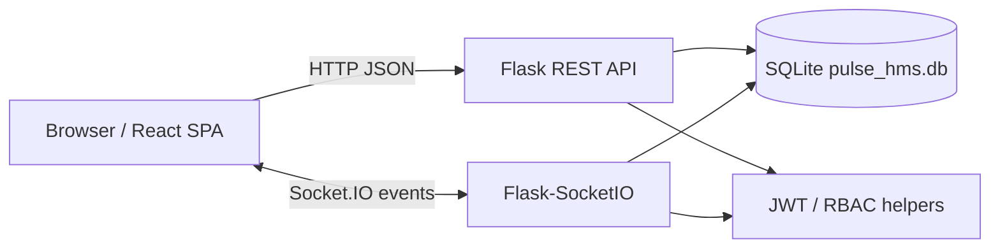
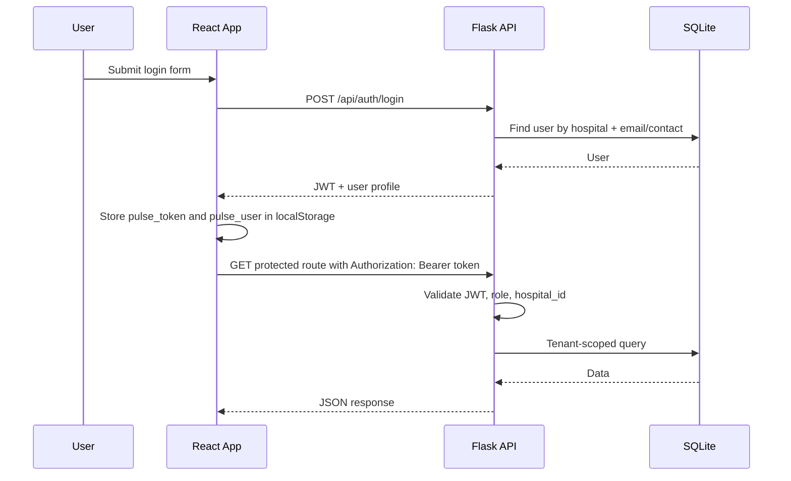
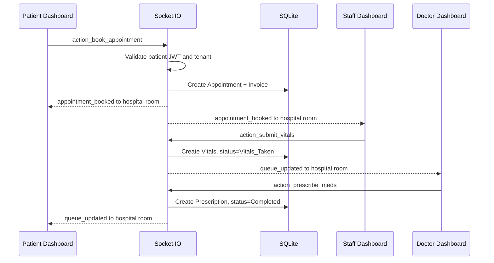
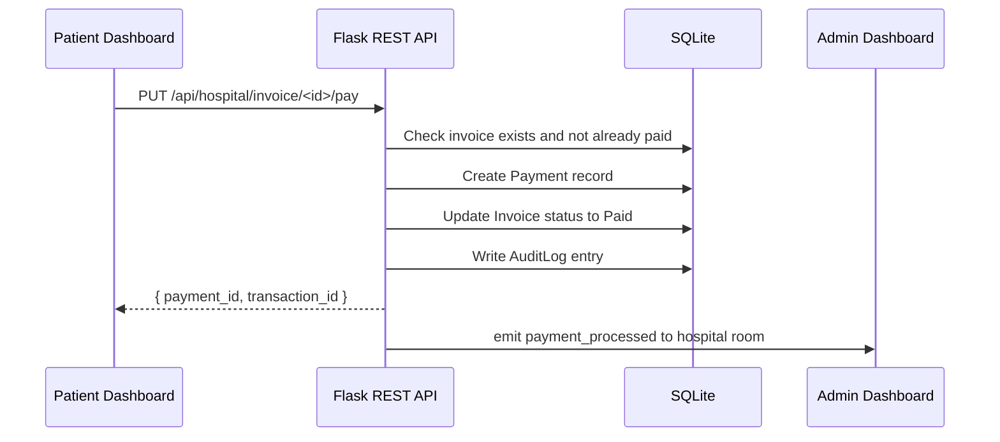
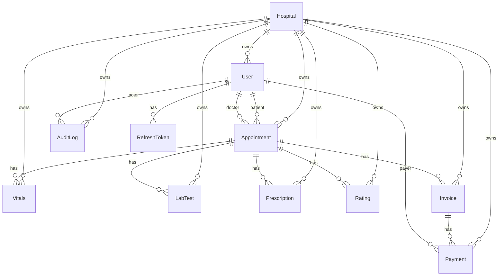
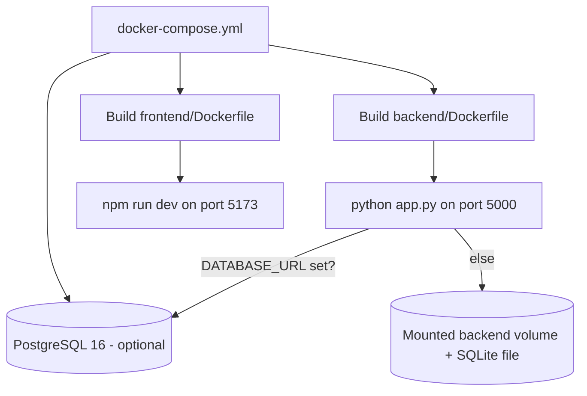

# Pulse HMS Architecture

Last reviewed: 2026-06-15

This document describes the architecture that exists in the current implementation. It does not describe a target architecture unless explicitly marked as an improvement.

## System Design

Pulse HMS is a multi-role hospital management prototype with a React frontend, Flask backend, SQLite database, and Socket.IO real-time event channel.



Current runtime components:

- `frontend/`: React + Vite single-page app with lazy-loaded role dashboards.
- `backend/`: Flask API, Flask-SocketIO server, SQLAlchemy models, domain service modules.
- `backend/pulse_hms.db`: SQLite database used by the local app.
- `docker-compose.yml`: development-oriented backend and frontend services with optional PostgreSQL.
- `(removed) old_vanilla_version/`: legacy implementation, archived and removed.

## Folder Structure

```text
pulse-hms-platform/
  backend/
    app.py                 # Flask app, Socket.IO handler registration, middleware
    auth_routes.py         # Auth, doctor listing, admin user routes
    auth_utils.py          # JWT, role, tenant helper functions
    audit.py               # Audit log helper (log_action)
    config.py              # Configuration class loading env vars
    hospital_routes.py     # Hospital operations, queues, billing, summaries
    patient_routes.py      # Patient appointment/prescription/profile endpoints
    models.py              # SQLAlchemy models (10 tables)
    seed.py                # Local seed/reset script
    validation.py          # Request payload validation helpers
    services/              # Domain service layer (socket event handlers)
      __init__.py          # Shared socket helpers and session management
      appointment.py       # Appointment booking, arrival, cancellation
      vitals.py            # Vitals submission
      lab.py               # Lab test prescribing, payment, reporting
      pharmacy.py          # Prescription and dispensing
    migrations/            # Alembic migration repository
    tests/                 # Pytest test suite (29 tests)
    pulse_hms.db           # Local SQLite database file
    requirements.txt
    Dockerfile
    .env.example
  frontend/
    src/
      App.jsx              # Router, providers, lazy-loaded dashboards
      main.jsx             # Entry point
      components/
        LandingPage.jsx
        HospitalRegistration.jsx
        Login.jsx
        Layout.jsx
        ErrorBoundary.jsx
        PatientDashboard.jsx       # Orchestrator (~220 lines)
        DoctorDashboard.jsx
        StaffDashboard.jsx
        AdminDashboard.jsx
        SuperAdminDashboard.jsx
        patient/                   # 7 extracted sub-components
          ActiveAppointments.jsx
          ActiveLabTests.jsx
          MedicalHistory.jsx
          PatientBilling.jsx
          PatientProfile.jsx
          PatientBookingPanel.jsx
          RescheduleModal.jsx
      context/
        AuthContext.jsx
        NotificationContext.jsx
        SocketContext.jsx
      lib/
        api.js
        pdf.js                     # PDF generation utilities
    public/
    package.json
    vite.config.js
    Dockerfile
    .env.example
  docs/
    architecture.md
    backend.md
    frontend.md
    api.md
    database.md
    deployment.md
    current-status.md
    coding-standards.md
    enterprise-roadmap.md
    ai-bootstrap.md
    architectural-weaknesses.md
    decisions/                     # 5+ ADRs
    phases/                        # Phase analyses and handoffs
    templates/                     # Reusable documentation templates
  .github/
    workflows/
      lint-format.yml
      test.yml
      security-scan.yml
      docker-build.yml
  Makefile
  docker-compose.yml
  .pre-commit-config.yaml
  .trivy.yaml
  SETUP_GUIDE.md
  AGENTS.md
```

## Service Boundaries

### Frontend Boundary

The frontend owns:

- Route selection and client-side role guarding.
- Local authentication state in `localStorage`.
- Dashboard UI for patient, doctor, staff, admin, and superadmin roles.
- REST calls through `frontend/src/lib/api.js` (`apiFetch`).
- Socket connection setup through `SocketContext`.
- PDF generation using `jspdf` (prescriptions, discharge summaries, invoices).

The frontend does not own authoritative authorization. It hides or redirects UI, but backend routes and socket handlers enforce access.

### Backend Boundary

The backend owns:

- JWT issuance and verification.
- Role and tenant checks via `auth_utils.py`.
- Database writes and reads.
- Appointment workflow state transitions.
- Real-time queue events via domain service modules.
- Billing and invoice status with Payment record creation.
- Audit logging for clinical and billing actions.
- Structured JSON logging with request ID tracking.
- Doctor, staff, patient, and admin API responses.

### Database Boundary

The current database is a single SQLite database with shared tables. Tenant ownership is represented by `hospital_id` on tenant-owned models. PostgreSQL is available via `DATABASE_URL` for production.

## Data Flow

### Login And Authenticated REST Flow



### Appointment Queue Flow



### Invoice Payment Flow



## API Layers

The backend exposes REST API groups:

- `/api/auth/*`: hospital registration, patient registration, login, doctors, admin users.
- `/api/patients/*`: patient appointments, prescriptions, profile update.
- `/api/hospital/*`: queues, analytics, tests, pharmacy, ratings, availability, slots, notes, invoices, summaries, search, payment.
- `/api/ping`, `/api/health`: health checks.

Socket.IO events for workflow mutations are handled by domain service modules in `backend/services/`:

| Module | Events |
| --- | --- |
| `services/appointment.py` | `action_book_appointment`, `action_arrive`, `action_cancel_appointment` |
| `services/vitals.py` | `action_submit_vitals` |
| `services/lab.py` | `action_prescribe_test`, `action_pay_test`, `action_upload_test_report` |
| `services/pharmacy.py` | `action_prescribe_meds`, `action_dispense_meds` |

Server emits `appointment_booked`, `queue_updated`, `payment_processed`, and error events to tenant rooms.

## Caching, Workers, And Integrations

Current implementation:

- Caching layer: none.
- Async job/worker system: none.
- External payment integration: none.
- External email/SMS integration: none.
- External object/file storage integration: none.
- Monitoring/observability integration: none.

Socket.IO is used for real-time workflow events, but it is not a background job system.

## Authentication Flow

Current auth uses JWTs from `flask-jwt-extended`.

- Tokens are created in `auth_routes.py`.
- Token identity is the user id as a string.
- Additional claims contain `role` and `hospital_id`.
- Frontend stores token in `localStorage` as `pulse_token`.
- `apiFetch` attaches the token to REST calls.
- `SocketContext` sends the token in the Socket.IO `auth` payload.
- `auth_utils.py` centralizes role and tenant helper functions.

Current roles:

- `patient`
- `doctor`
- `staff`
- `admin`
- `superadmin`

## State Management

There is no Redux or server-state library. State management is component-local plus React Context.

Current contexts:

- `AuthContext`: stores `user`, `token`, `login`, and `logout`.
- `NotificationContext`: exposes notification helpers.
- `SocketContext`: creates one Socket.IO connection when a user is logged in.

Dashboard data is fetched and stored in local `useState` hooks inside each dashboard component.

## Database Relationships

The models are defined in `backend/models.py`.



SQLAlchemy models currently define foreign keys but not full relationship properties. Most route code fetches related rows manually with `User.query.get(...)`, `Appointment.query.get(...)`, or filtered queries.

## Important Patterns

- Tenant isolation is implemented by filtering records by `hospital_id`.
- Role authorization is implemented with `@require_roles(...)`.
- Public auth routes are intentionally unauthenticated.
- REST calls are centralized through `apiFetch`.
- Socket events are authorized using a per-socket session map in `services/__init__.py`.
- Real-time events are emitted to tenant rooms named `hospital:<hospital_id>`.
- The app uses `db.create_all()` only when `AUTO_CREATE_TABLES=true` (dev fallback; Alembic is the primary schema management method).
- Seed data is upserted by `backend/seed.py`; destructive local resets require `python seed.py --reset`.
- Audit records are created via `log_action()` — never fails the primary operation.
- Request IDs are auto-generated and propagated in response headers and logs.

## Environment Variables

Backend:

| Variable | Current Use |
| --- | --- |
| `SECRET_KEY` | Flask secret key, default `pulse-dev-secret` |
| `JWT_SECRET_KEY` | JWT signing key, default `pulse-dev-jwt-secret` |
| `DATABASE_URL` | SQLAlchemy database URI, default local SQLite |
| `CORS_ORIGINS` | Comma-separated allowed frontend origins, default `http://localhost:5173` |
| `FLASK_ENV` | Set in Docker Compose, not deeply used by the app |
| `AUTO_CREATE_TABLES` | Dev fallback toggle for schema bootstrap (default `true`) |

Frontend:

| Variable | Current Use |
| --- | --- |
| `VITE_API_URL` | Base REST API URL, default `http://localhost:5000/api` |
| `VITE_SOCKET_URL` | Socket.IO URL, default derived from `VITE_API_URL` |

## Deployment Flow

The current deployment setup is development-oriented.



Current Docker Compose:

- Builds backend from `backend/`.
- Mounts `./backend:/app`.
- Runs `python app.py`.
- Builds frontend from `frontend/`.
- Runs Vite dev server with `--host 0.0.0.0`.
- Optional PostgreSQL 16 service (`db`) with health check.

This is useful for local development, not production deployment.

## CI/CD

Current implementation:

- 4 GitHub Actions workflows on push/PR to `main`:
  - `lint-format.yml`: ruff check + ESLint
  - `test.yml`: `pytest -q` (29 tests) + `npm run build`
  - `security-scan.yml`: ruff security rules + pip-audit + Trivy
  - `docker-build.yml`: multi-stage Docker image build validation
- Backend test suite: 29 tests (auth, tenant isolation, validation, socket mutations, workflow integration).
- Frontend validation: `npm run build` + `npm run lint` (0 errors, 0 warnings).
- Migration check: `flask --app backend/app.py db -d backend/migrations check`.

## Architectural Weaknesses

Canonical detailed list: `docs/architectural-weaknesses.md`.

Highest-impact current weaknesses:

- No frontend tests.
- No payment gateway integration.
- No refresh token rotation or rate limiting.
- No request validation library (inline helpers only).
- No standardized error response shape.
- Team still uses SQLite in CI (no PostgreSQL).
- Socket sessions are in-memory (not horizontally scalable).
- Superadmin dashboard uses mock data.
- No monitoring, alerting, or backup flows.

## Suggested Improvements

These are recommendations only; they are not implemented in this documentation pass.

- Add refresh token rotation (short-lived access + long-lived refresh).
- Add rate limiting on auth/public endpoints.
- Add password policy enforcement.
- Wire Stripe/Razorpay payment gateway.
- Add frontend tests (component + workflow).
- Replace mock superadmin data with real platform tenant APIs.
- Use production WSGI/Socket.IO deployment (gunicorn + eventlet).
- Serve frontend production build via Nginx/Caddy.
- Add Redis for Socket.IO session store and horizontal scaling.
- Add API versioning, request validation (Pydantic/marshmallow), and consistent error responses.
- Add PostgreSQL to CI.
- Add database backup/restore flow.
- Add Sentry or similar error monitoring.
