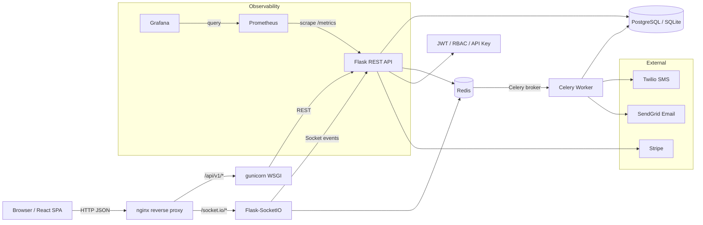
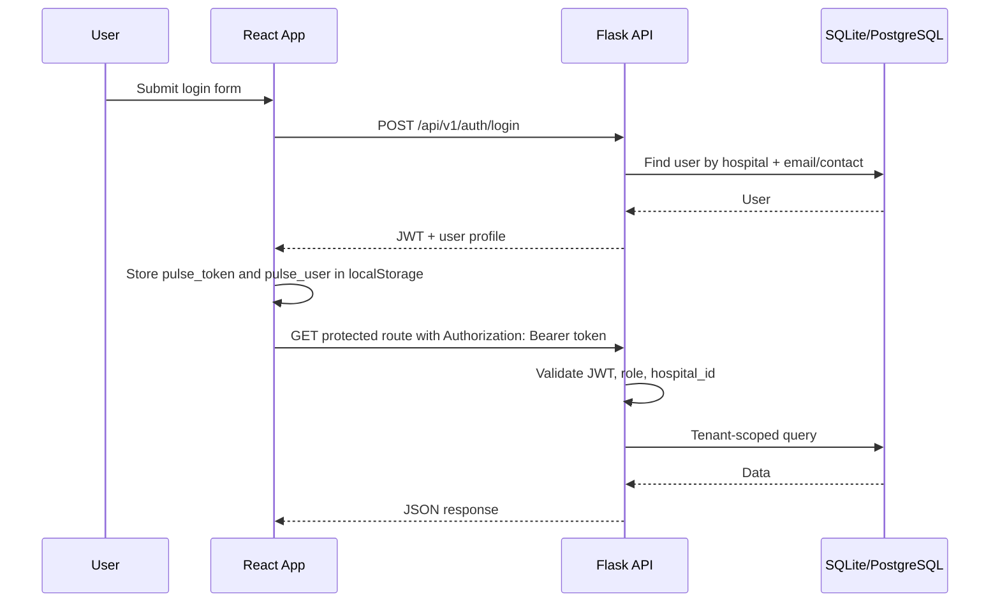
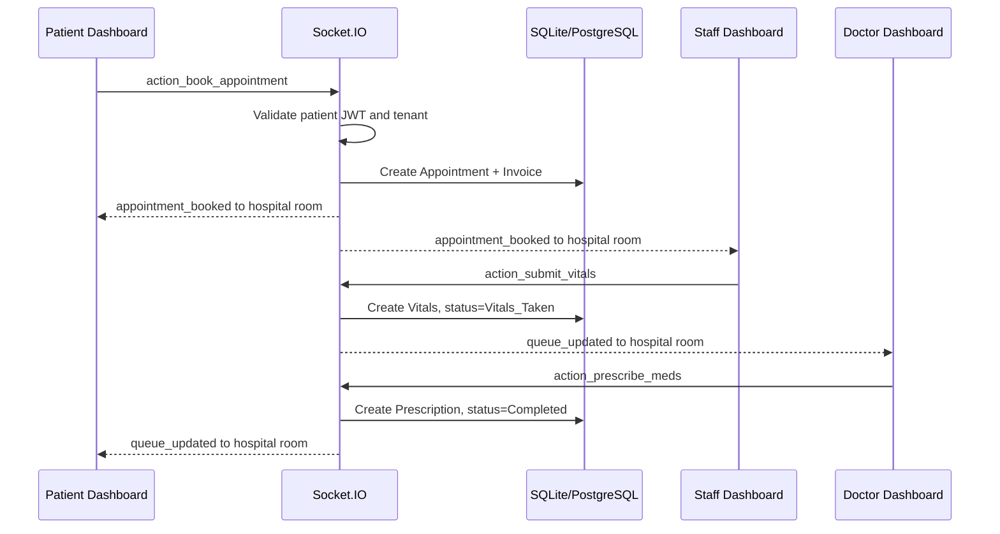
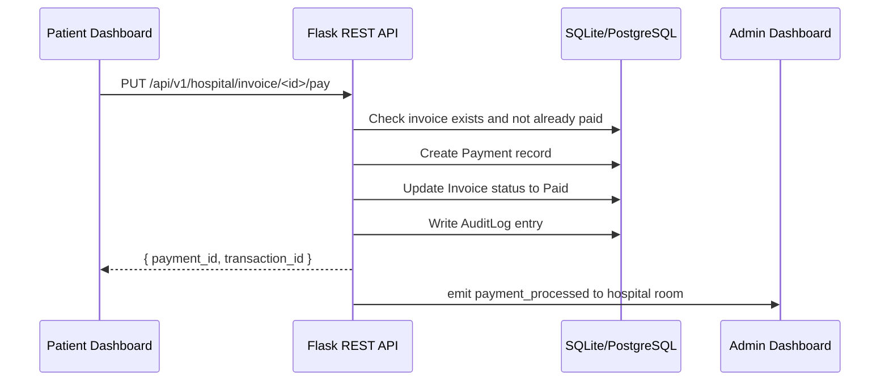
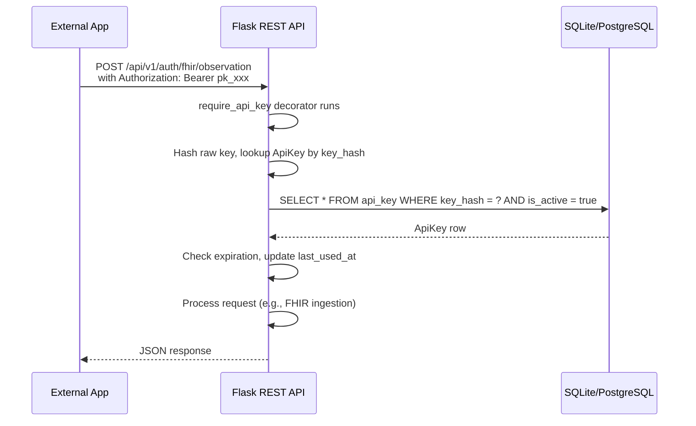
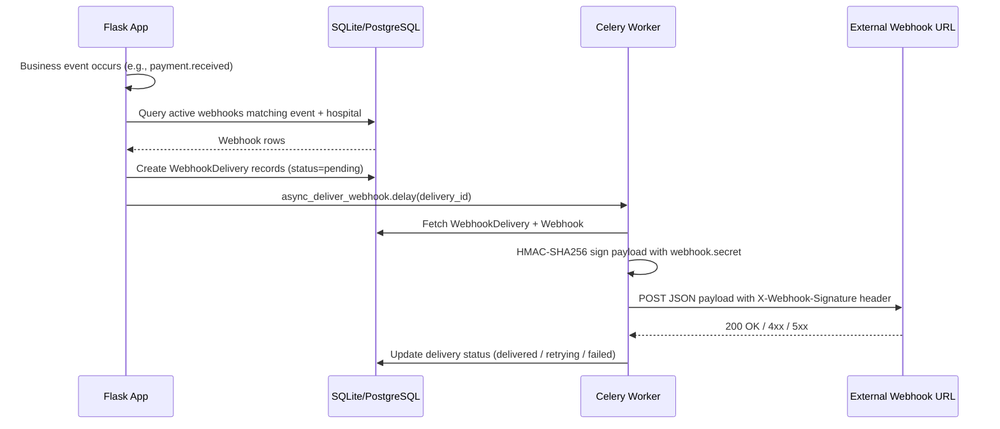
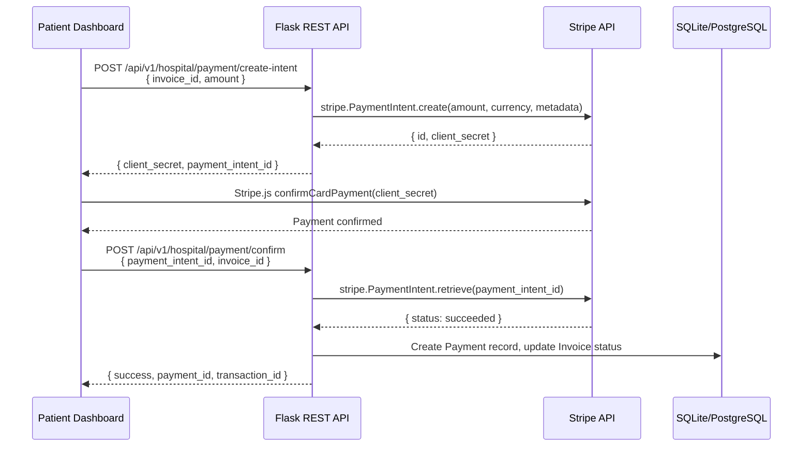
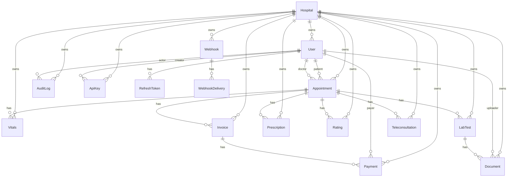
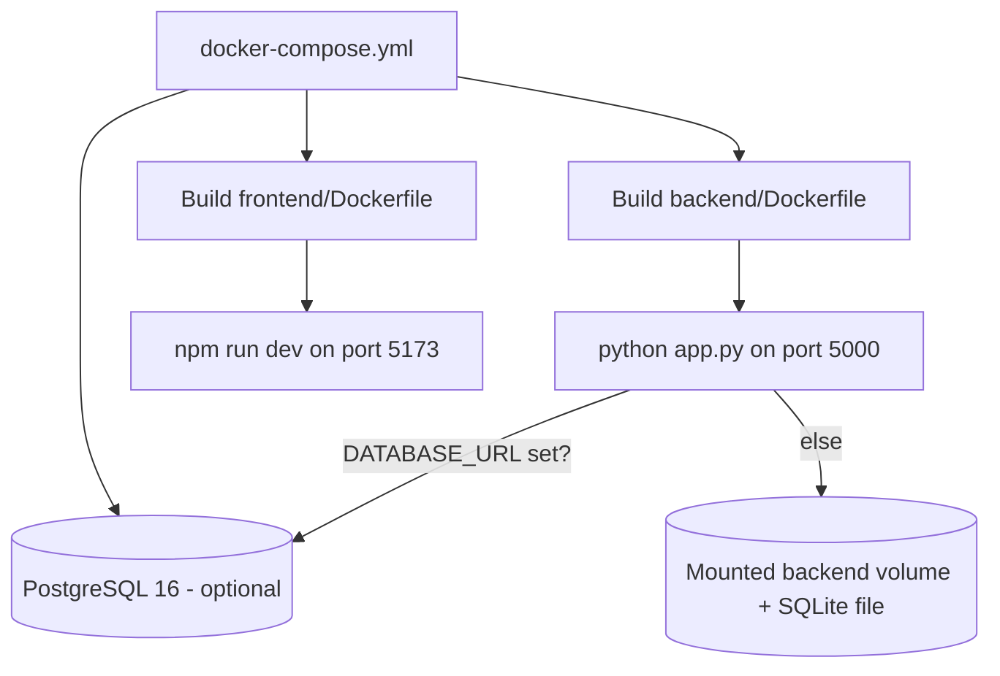
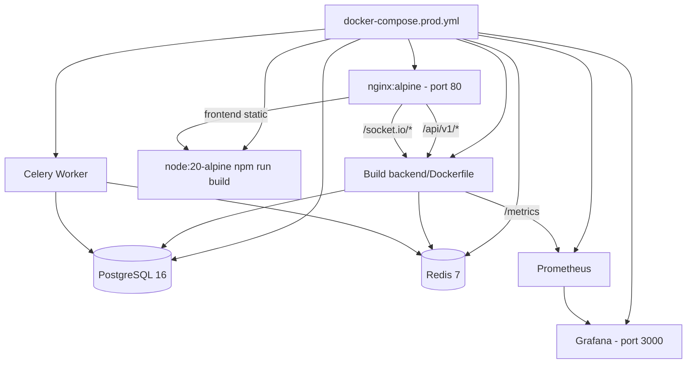

# Pulse HMS Architecture

Last reviewed: 2026-06-19

This document describes the architecture that exists in the current implementation. It does not describe a target architecture unless explicitly marked as an improvement.

## System Design

Pulse HMS is a multi-role hospital management prototype with a React frontend, Flask backend, PostgreSQL database (SQLite in dev), Redis caching/messaging layer, Celery worker for background jobs, and Socket.IO real-time event channel.



Current runtime components:

- `frontend/`: React + Vite single-page app with lazy-loaded role dashboards, TanStack React Query, Zustand stores, and Zod schemas.
- `backend/`: Flask API, Flask-SocketIO server, SQLAlchemy models (15 tables), domain service modules, Celery task definitions, Stripe/Twilio/SendGrid integrations.
- `backend/pulse_hms.db`: SQLite database used by the local app (PostgreSQL in production).
- `redis`: Caching (Flask-Caching), rate limiting (Flask-Limiter Redis backend), Celery broker, Socket.IO message queue.
- `celery-worker`: Background job processing (invoice PDF generation, webhook dispatch, notifications).
- `nginx.conf`: Reverse proxy with frontend static serving, API proxy to gunicorn, WebSocket upgrade support.
- `gunicorn.conf.py`: Production WSGI server with JSON access logging.
- `docker-compose.yml`: development-oriented backend and frontend services with optional PostgreSQL.
- `docker-compose.prod.yml`: production stack with nginx, gunicorn, PostgreSQL 16, Redis, Celery worker, Prometheus, Grafana.
- `prometheus.yml`: Metrics scraping configuration for the Flask `/metrics` endpoint.
- `grafana/`: Auto-provisioned dashboards and datasource for monitoring.
- `load-testing/`: k6 load testing script.

## Folder Structure

```text
pulse-hms-platform/
  backend/
    app.py                 # Flask app, Socket.IO handler registration, middleware, blueprint mounting
    auth_routes.py         # Auth, doctor listing, admin user routes, refresh token rotation
    auth_utils.py          # JWT, role, tenant helper functions (require_roles, tenant_get, etc.)
    audit.py               # Audit log helper (log_action)
    config.py              # Configuration class loading env vars with production validation
    hospital_routes.py     # Hospital operations, queues, billing, summaries, search, payment
    patient_routes.py      # Patient appointment/prescription/profile endpoints
    models.py              # SQLAlchemy models (15 tables: Hospital, User, RefreshToken, Appointment, Vitals, LabTest, Prescription, Rating, Invoice, Payment, Document, ApiKey, Webhook, WebhookDelivery, Teleconsultation, AuditLog)
    seed.py                # Local seed/reset script
    validation.py          # Request payload validation helpers (json_body, int_field, require_fields)
    logging_config.py      # Structured JSON logging, request ID middleware
    encryption.py          # Fernet-based PII encryption (EncryptedField + explicit helpers)
    rate_limit.py          # Rate limiter init, tenant_key/user_key functions
    cache.py               # Flask-Caching Cache instance
    middleware.py           # Query timeout decorator (SIGALRM on Unix)
    pagination.py          # Backward-compatible pagination helpers (get_pagination_params, paginate, paginated_response)
    api_key.py             # API key generation, hashing, verification, require_api_key decorator
    api_key_routes.py      # API key CRUD blueprint
    webhook.py             # Webhook dispatch engine (HMAC signing, event filtering, sync/async delivery)
    webhook_routes.py      # Webhook CRUD blueprint
    payments_stripe.py     # Stripe PaymentIntent creation and confirmation (mock mode when unconfigured)
    notifications.py       # Twilio SMS + SendGrid email with graceful fallback
    telemedicine_routes.py # Teleconsultation room management (Jitsi)
    fhir.py                # FHIR Observation parser (HL7/FHIR lab data ingestion)
    fhir_routes.py         # FHIR REST endpoints
    usage.py               # In-memory API usage tracker
    usage_analytics.py     # Historical AuditLog-based usage analytics
    celery_app.py          # Celery app initialization
    tasks.py               # Celery tasks (generate_invoice_pdf, send_notification, async_deliver_webhook)
    upload_service.py      # File upload service (Document model, local filesystem storage)
    wsgi.py                # Gunicorn entry point
    gunicorn.conf.py       # Gunicorn configuration (JSON logs, access format)
    services/              # Domain service layer (socket event handlers)
      __init__.py           # Shared socket helpers and session management
      appointment.py        # Appointment booking, arrival, cancellation
      vitals.py             # Vitals submission
      lab.py                # Lab test prescribing, payment, reporting
      pharmacy.py           # Prescription and dispensing
    migrations/             # Alembic migration repository (10+ migrations)
    tests/                  # Pytest test suite (49 tests)
      conftest.py           # Fixtures and app factory
      test_api.py           # 7 API tests
      test_socket.py        # 6 socket event tests
      test_workflow.py      # 16 workflow tests
      test_integrations.py  # 20 integration tests
    pulse_hms.db            # Local SQLite database file
    requirements.txt
    Dockerfile
    .env.example
  frontend/
    src/
      App.tsx               # Router, providers, lazy-loaded dashboards, React Query + Sentry init
      main.tsx              # Entry point
      components/
        LandingPage.tsx
        HospitalRegistration.tsx
        Login.tsx
        Layout.tsx
        ErrorBoundary.tsx
        NotificationRenderer.tsx
        PatientDashboard.tsx
        DoctorDashboard.tsx
        StaffDashboard.tsx
        AdminDashboard.tsx
        SuperAdminDashboard.tsx
        patient/                   # 7 sub-components
          ActiveAppointments.tsx
          ActiveLabTests.tsx
          MedicalHistory.tsx
          PatientBilling.tsx
          PatientProfile.tsx
          PatientBookingPanel.tsx
          RescheduleModal.tsx
        doctor/                    # 3 sub-components
          DoctorStatsCards.tsx
          DoctorQueuePanel.tsx
          DoctorActivePatientPanel.tsx
        staff/                     # 3 sub-components
          VitalsPanel.tsx
          LabPanel.tsx
          PharmacyPanel.tsx
        admin/                     # 5 sub-components
          AdminStatsCards.tsx
          AdminAnalyticsCharts.tsx
          AdminUserManagement.tsx
          AdminSearchPanel.tsx
          AdminDeveloperPortal.tsx
        common/                    # Shared UI components
          StatCard.tsx
          Skeleton.tsx
        ui/                        # Shared UI library
          index.ts
          Button.tsx
          Input.tsx
          Card.tsx
          Modal.tsx
      context/
        AuthContext.tsx
        SocketContext.tsx
      hooks/                       # Custom hooks
        useDataFetch.ts
        useApi.ts                  # TanStack Query wrappers (useApiQuery, useApiMutation)
        useSocketRefresh.ts
      stores/                      # Zustand stores
        useNotificationStore.ts
        useThemeStore.ts
      lib/
        api.ts                     # apiFetch, apiJson, token management, refresh rotation
        pdf.ts                     # PDF generation utilities (jsPDF)
        schemas.ts                 # Zod validation schemas (hospital, booking, vitals, profile)
      test/                        # Frontend tests
        setup.js
        useNotificationStore.test.ts
        StatCard.test.jsx
    public/
    package.json
    vite.config.ts
    Dockerfile
    .env.example
  docs/
    architecture.md
    backend.md
    frontend.md
    api.md
    database.md
    deployment.md
    current-status.md
    coding-standards.md
    enterprise-roadmap.md
    ai-bootstrap.md
    architectural-weaknesses.md
    phase-14-testing.md
    decisions/                     # 10+ ADRs
    phases/                        # Phase analyses and handoffs
    templates/                     # Reusable documentation templates
  grafana/
    dashboards/
      dashboard.yml                # Dashboard auto-provisioning config
      pulse-hms-overview.json      # Grafana dashboard definition
    datasources/
      datasource.yml               # Prometheus datasource auto-provisioning
  load-testing/
    script.k6.js                   # k6 load testing script
  .github/
    workflows/
      lint-format.yml
      test.yml
      security-scan.yml
      docker-build.yml
  nginx.conf                       # nginx reverse proxy config
  prometheus.yml                   # Prometheus scrape config
  Makefile
  docker-compose.yml               # Dev stack
  docker-compose.prod.yml          # Production stack (+Celery, Prometheus, Grafana)
  pyproject.toml
  pytest.ini
  .pre-commit-config.yaml
  .trivy.yaml
  .env.example
  .env.prod.example
  SETUP_GUIDE.md
  AGENTS.md
```

## Service Boundaries

### Frontend Boundary

The frontend owns:

- Route selection and client-side role guarding.
- Local authentication state in `localStorage` (access + refresh tokens).
- Dashboard UI for patient, doctor, staff, admin, and superadmin roles.
- REST calls through `frontend/src/lib/api.ts` (`apiFetch` / `apiJson`) with automatic token refresh.
- Socket connection setup through `SocketContext`.
- Server-state caching via TanStack React Query (`hooks/useApi.ts`).
- Client state via Zustand stores (`useNotificationStore`, `useThemeStore`).
- PDF generation using `jspdf` (prescriptions, discharge summaries, invoices).
- Zod schema validation (`lib/schemas.ts`) for forms (hospital registration, booking, vitals, profile).

The frontend does not own authoritative authorization. It hides or redirects UI, but backend routes and socket handlers enforce access.

### Backend Boundary

The backend owns:

- JWT issuance, verification, and refresh token rotation.
- Role and tenant checks via `auth_utils.py`.
- API key authentication via `api_key.py` (`require_api_key` decorator).
- Database writes and reads with tenant-scoped queries.
- Appointment workflow state transitions.
- Real-time queue events via domain service modules.
- Billing and invoice status with Payment record creation (cash + online/Stripe).
- Audit logging for clinical and billing actions.
- Structured JSON logging with request ID tracking.
- Doctor, staff, patient, and admin API responses.
- Celery task processing (invoice PDF generation, webhook dispatch, notifications).
- Stripe payment processing (PaymentIntent create/confirm, mock fallback).
- FHIR data ingestion (Observation parser).
- Webhook dispatch (HMAC-SHA256 signed, Celery-backed retry).
- API key management and authentication.
- Telemedicine room management (Jitsi).
- API usage analytics (in-memory tracker + AuditLog-based historical queries).
- Background job queue (Celery/Redis).

### Database Boundary

The current database is a single SQLite database (dev) or PostgreSQL (prod) with shared tables. Tenant ownership is represented by `hospital_id` on tenant-owned models. 15 models are defined in `backend/models.py`.

## Data Flow

### Login And Authenticated REST Flow



### Appointment Queue Flow



### Invoice Payment Flow



### API Key Auth Flow



### Webhook Dispatch Flow



### Stripe Payment Flow



## API Layers

The backend exposes REST API groups under `/api/v1/` (legacy `/api/` routes redirect via 301):

- `/api/v1/auth/*`: hospital registration, patient registration, login, doctors, admin users, token refresh, API key CRUD, webhook CRUD.
- `/api/v1/patients/*`: patient appointments, prescriptions, profile update.
- `/api/v1/hospital/*`: queues, analytics, tests, pharmacy, ratings, availability, slots, notes, invoices, summaries, search, payment, telemedicine, FHIR ingestion.
- `/api/v1/superadmin/*`: hospital CRUD, plan changes, platform-wide stats.
- `/api/v1/ping`, `/api/v1/health`, `/api/v1/health/db`: health checks.
- `/api/v1/admin/usage`, `/api/v1/admin/usage/live`: usage analytics.
- `/api/v1/metrics`: Prometheus metrics.
- `/api/v1/docs/`: Swagger/OpenAPI UI.
- `/api/v1/swagger.json`: OpenAPI spec.

Socket.IO events for workflow mutations are handled by domain service modules in `backend/services/`:

| Module | Events |
| --- | --- |
| `services/appointment.py` | `action_book_appointment`, `action_arrive`, `action_cancel_appointment` |
| `services/vitals.py` | `action_submit_vitals` |
| `services/lab.py` | `action_prescribe_test`, `action_pay_test`, `action_upload_test_report` |
| `services/pharmacy.py` | `action_prescribe_meds`, `action_dispense_meds` |

Server emits `appointment_booked`, `queue_updated`, `payment_processed`, and error events to tenant rooms.

## Caching, Workers, And Integrations

### Redis Caching

Flask-Caching is configured in `backend/cache.py` and initialized in `app.py`:

- **Dev mode**: `SimpleCache` (in-process).
- **Production mode**: `RedisCache` via `REDIS_URL` with 60s default timeout.
- Used for caching analytics/stats responses in `hospital_routes.py` and `superadmin_routes.py`.

### Celery Workers

`backend/celery_app.py` creates the Celery app with Redis as broker (`REDIS_URL`). Workers run in `docker-compose.prod.yml`:

- **`generate_invoice_pdf`**: Creates PDF invoices via ReportLab, stores as Document records (max 3 retries, 60s delay).
- **`send_notification`**: Dispatches SMS (Twilio) or email (SendGrid) based on notification type.
- **`async_deliver_webhook`**: Delivers webhook payloads to configured URLs with retry logic (max 3 retries, 60s initial delay).

### Stripe Payment Integration

`backend/payments_stripe.py` provides:

- `create_payment_intent(amount_cents, currency, metadata)` — creates Stripe PaymentIntent or returns mock when `STRIPE_SECRET_KEY` is unset.
- `confirm_payment(payment_intent_id)` — retrieves PaymentIntent status or returns mock.
- Frontend uses Stripe.js for card collection; backend never handles raw card data.
- Payment method supports `cash`, `card`, `online`, `insurance`.

### Twilio / SendGrid Notifications

`backend/notifications.py` provides:

- `send_sms(to, message)` — sends via Twilio REST API, falls back gracefully when unconfigured.
- `send_email(to, subject, body, html)` — sends via SendGrid v3 API, falls back gracefully when unconfigured.
- Both use lazy imports + graceful `NotificationResult` dataclass.

### File Upload Service

`backend/upload_service.py` handles:

- File upload validation (allowed extensions from `Config.ALLOWED_EXTENSIONS`).
- Secure filename sanitization.
- Local filesystem storage under `Config.UPLOAD_FOLDER`.
- `Document` model records for uploaded files (linked to lab tests, patients, uploaders).

### Sentry Error Tracking

Optional Sentry integration (configured via `SENTRY_DSN`):

- Backend: initialized in `app.py` with 0.2 traces sample rate.
- Frontend: initialized in `App.tsx` via `@sentry/react` with browser tracing.

### Prometheus Metrics

- Flask endpoint at `/metrics` via `prometheus_flask_exporter`.
- Metrics grouped by endpoint.
- Scraped by Prometheus (configured in `prometheus.yml`).

### Grafana Dashboards

- Auto-provisioned via `grafana/datasources/datasource.yml` and `grafana/dashboards/dashboard.yml`.
- `pulse-hms-overview.json` provides a pre-built monitoring dashboard.
- Grafana runs on port 3000 in production Docker Compose.

### Webhook System

`backend/webhook.py` and `backend/webhook_routes.py`:

- Webhooks registered per-hospital with event filters, HMAC secret, retry count, and timeout.
- `dispatch_event(event, payload, hospital_id)` finds matching webhooks and creates `WebhookDelivery` records.
- Delivery is attempted via Celery (`async_deliver_webhook.delay`) with synchronous fallback.
- Payloads signed with HMAC-SHA256 (`X-Webhook-Signature` header).
- Supported events: `appointment.created`, `appointment.updated`, `appointment.cancelled`, `lab.requested`, `lab.completed`, `prescription.issued`, `prescription.dispensed`, `payment.received`, `patient.registered`, `invoice.generated`.

### API Key Auth

`backend/api_key.py` and `backend/api_key_routes.py`:

- API keys generated as `pk_` prefixed random tokens.
- Stored as SHA-256 hash; only prefix is exposed to users.
- `require_api_key` decorator validates `Authorization: Bearer <key>` header.
- Keys support scopes, expiration, and per-hospital isolation.
- Admin Developer Portal UI for key management.

## Authentication Flow

### JWT Authentication

Current auth uses JWTs from `flask-jwt-extended`.

- Tokens are created in `auth_routes.py`.
- Token identity is the user id as a string.
- Additional claims contain `role` and `hospital_id`.
- Access tokens expire in 30 minutes; refresh tokens expire in 30 days.
- Refresh token rotation: each refresh invalidates the old token and issues a new pair.
- Frontend stores access token in `localStorage` as `pulse_token` and refresh token as `pulse_refresh_token`.
- `apiFetch` attaches the token to REST calls and auto-refreshes on 401.
- `SocketContext` sends the token in the Socket.IO `auth` payload.
- `auth_utils.py` centralizes role and tenant helper functions:
  - `@require_roles(...)` — decorator for role-based access.
  - `current_user()` / `current_hospital_id()` — extracts from JWT claims.
  - `tenant_get(model, id)` — tenant-scoped query helper.

Current roles:

- `patient`
- `doctor`
- `staff`
- `admin`
- `superadmin`

### API Key Authentication

API keys provide an alternative auth mechanism for external integrations:

- Header: `Authorization: Bearer pk_<random_token>`.
- Validated by `require_api_key` decorator in `api_key.py`.
- Hash-based lookup (`SHA-256`) with active/expiration checks.
- Scoped per hospital via `ApiKey.hospital_id`.
- Admin portal (Developer Portal tab) provides key CRUD UI.
- Primarily used for FHIR data ingestion endpoints and future external API access.

## State Management

### Client State (Zustand)

Two Zustand stores provide global UI state:

- `useNotificationStore`: toast notification queue with auto-dismiss (4s), `notify.success/error/info/warning` convenience helpers.
- `useThemeStore`: light/dark theme toggle persisted to `localStorage`.

### Server State (TanStack React Query)

- `QueryClientProvider` wraps the app in `App.tsx`.
- `useApiQuery` hook wraps `useQuery` with `apiFetch`, configurable stale time (default 30s), and optional transform.
- `useApiMutation` hook wraps `useMutation` with automatic success/error notifications, query invalidation.
- Query DevTools available in development.

### Legacy Context

Three React contexts remain for legacy state sharing:

- `AuthContext`: stores `user`, `token`, `login`, and `logout`.
- `SocketContext`: creates one Socket.IO connection when a user is logged in.

### Legacy Hooks

- `useDataFetch`: simple GET fetch hook with loading/error state (being replaced by `useApiQuery`).
- `useSocketRefresh`: subscribes to socket events for data refresh callbacks.

## Database Relationships

The models are defined in `backend/models.py` (15 tables).



SQLAlchemy models currently define foreign keys but not full relationship properties. Most route code fetches related rows manually with `User.query.get(...)`, `Appointment.query.get(...)`, or filtered queries. This is a known weakness with N+1 query patterns.

## Important Patterns

- Tenant isolation is implemented by filtering records by `hospital_id`.
- Role authorization is implemented with `@require_roles(...)`.
- API key authorization is implemented with `@require_api_key(...)`.
- Public auth routes are intentionally unauthenticated.
- REST calls are centralized through `apiFetch` with automatic JWT refresh.
- Socket events are authorized using a per-socket session map in `services/__init__.py`.
- Real-time events are emitted to tenant rooms named `hospital:<hospital_id>`.
- The app uses `db.create_all()` only when `AUTO_CREATE_TABLES=true` (dev fallback; Alembic is the primary schema management method).
- Seed data is upserted by `backend/seed.py`; destructive local resets require `python seed.py --reset`.
- Audit records are created via `log_action()` — never fails the primary operation.
- Request IDs are auto-generated and propagated in response headers and logs.
- Webhook payloads are signed with HMAC-SHA256 using per-webhook secrets.
- Notification providers (Twilio, SendGrid) use lazy imports + graceful fallback.
- Stripe integration uses mock mode when `STRIPE_SECRET_KEY` is unset.
- Rate limiting is Redis-backed in production, in-memory fallback in dev.
- Pagination is backward-compatible: all list endpoints return full arrays by default, with optional `?page=N&per_page=N`.

## Environment Variables

Backend:

| Variable | Current Use |
| --- | --- |
| `SECRET_KEY` | Flask secret key, default `pulse-dev-secret` |
| `JWT_SECRET_KEY` | JWT signing key, default `pulse-dev-jwt-secret` |
| `DATABASE_URL` | SQLAlchemy database URI, default local SQLite |
| `CORS_ORIGINS` | Comma-separated allowed frontend origins, default `http://localhost:5173` |
| `FLASK_ENV` | Set in Docker Compose; production mode validates config |
| `AUTO_CREATE_TABLES` | Dev fallback toggle for schema bootstrap (default `true`) |
| `RATELIMIT_ENABLED` | Enable/disable rate limiting (default `true`) |
| `RATELIMIT_DEFAULT` | Default rate limit string (default `200 per day;50 per hour`) |
| `REDIS_URL` | Redis connection URI for caching, rate limiting, Celery broker, Socket.IO queue |
| `SOCKET_ASYNC_MODE` | Socket.IO async mode (`threading`, `gevent`, `eventlet`) |
| `SOCKET_MESSAGE_QUEUE` | Socket.IO message queue URI (defaults to `REDIS_URL`) |
| `ENCERYPTION_KEY` | Fernet encryption key for PII fields |
| `SENTRY_DSN` | Sentry DSN for error tracking |
| `GUNICORN_WORKERS` | Number of gunicorn worker processes (default `4`) |
| `SERVER_NAME` | Flask SERVER_NAME for URL generation |
| `QUERY_TIMEOUT_SECONDS` | Query timeout in seconds (default `10`) |
| `API_PREFIX` | API URL prefix (default `/api/v1`) |
| `UPLOAD_FOLDER` | File upload storage path |
| `TWILIO_ACCOUNT_SID` | Twilio account SID (optional, graceful fallback) |
| `TWILIO_AUTH_TOKEN` | Twilio auth token (optional) |
| `TWILIO_FROM_NUMBER` | Twilio sender phone number (optional) |
| `SENDGRID_API_KEY` | SendGrid API key (optional, graceful fallback) |
| `SENDGRID_FROM_EMAIL` | SendGrid sender email (optional) |
| `STRIPE_SECRET_KEY` | Stripe secret key (optional, mock fallback) |
| `STRIPE_PUBLISHABLE_KEY` | Stripe publishable key (optional) |

Frontend:

| Variable | Current Use |
| --- | --- |
| `VITE_API_URL` | Base REST API URL, default `http://localhost:5000/api/v1` |
| `VITE_SOCKET_URL` | Socket.IO URL, default derived from `VITE_API_URL` |
| `VITE_SENTRY_DSN` | Sentry DSN for frontend error tracking (optional) |

## Deployment Flow

### Development Deployment



Current Docker Compose (dev):

- Builds backend from `backend/`.
- Mounts `./backend:/app`.
- Runs `python app.py`.
- Builds frontend from `frontend/`.
- Runs Vite dev server with `--host 0.0.0.0`.
- Optional PostgreSQL 16 service (`db`) with health check.

### Production Deployment



Production Docker Compose:

- **nginx**: serves frontend production build, proxies `/api/v1/*` and `/socket.io/*` to backend.
- **backend**: gunicorn WSGI server (4 workers), Flask app, Socket.IO with gevent async mode, Redis-backed rate limiting + caching. Health check on `/api/health`.
- **frontend-builder**: one-shot container that runs `npm ci && npm run build` to populate a shared volume.
- **db**: PostgreSQL 16 with health check.
- **redis**: Redis 7 with persistence.
- **celery-worker**: Celery worker with 2 concurrency, connects to Redis broker.
- **prometheus**: Scrapes `/metrics` from backend every 15s.
- **grafana**: Grafana 11 with auto-provisioned dashboards and datasource, port 3000.

Backend runs with `FLASK_ENV=production`, which enforces:
- `SECRET_KEY` and `JWT_SECRET_KEY` must not be dev defaults.
- `DATABASE_URL` must use PostgreSQL.
- `AUTO_CREATE_TABLES` must be `false`.

## CI/CD

Current implementation:

- 4 GitHub Actions workflows on push/PR to `main`:
  - `lint-format.yml`: ruff check + ESLint
  - `test.yml`: `pytest -q` (49 tests) + `npm run build`
  - `security-scan.yml`: ruff security rules + pip-audit + Trivy
  - `docker-build.yml`: multi-stage Docker image build validation
- Backend test suite: 49 tests (7 API + 6 socket + 16 workflow + 20 integration).
- Frontend validation: `npm run build` + `npm run lint` (0 errors, 129 warnings — pre-existing `any` types).
- Frontend tests: 11 tests (useNotificationStore + StatCard).
- Migration check: `flask --app backend/app.py db -d backend/migrations check`.

## Architectural Weaknesses

Canonical detailed list: `docs/architectural-weaknesses.md`.

Highest-impact current weaknesses:

- No refresh token rotation or rate limiting (resolved).
- No payment gateway integration (resolved via Stripe).
- No request validation library (inline helpers only).
- No standardized error response shape (resolved via `validation.py`).
- Team still uses SQLite in CI (no PostgreSQL).
- Socket sessions are in-memory (not horizontally scalable).
- Superadmin dashboard uses mock data (resolved with real platform APIs).
- No monitoring, alerting, or backup flows (resolved via Sentry + Prometheus + Grafana).
- Frontend tests are minimal (11 tests vs 49 backend tests).
- String statuses (not enums) throughout workflow models.
- No SQLAlchemy relationship properties — manual lookups and N+1 patterns in routes.
- `encryption.py` has hardcoded PBKDF2 salt.
- Webhook delivery uses `urlopen` without explicit URL allowlisting (SSRF risk).
- Hardcoded Jitsi Meet URL in telemedicine_routes.py.
- Missing JWT decorator on `/api/v1/admin/usage` and `admin_usage()` routes.
- 10 N+1 query patterns across `hospital_routes`.
- 70+ hardcoded hex colors bypassing CSS variable theme system.
- 31 frontend files with excessive `any` types.
- No ARIA attributes or keyboard handlers on clickable elements.

## Suggested Improvements

These are recommendations only; they are not implemented in this documentation pass.

- Add password policy enforcement (resolved).
- Replace mock superadmin data with real platform tenant APIs (resolved).
- Use production WSGI/Socket.IO deployment (gunicorn + eventlet) (resolved).
- Serve frontend production build via Nginx/Caddy (resolved).
- Add Redis for Socket.IO session store and horizontal scaling (resolved).
- Add Sentry or similar error monitoring (resolved).
- Add API versioning, request validation (Pydantic/marshmallow), and consistent error responses (partially resolved).
- Add frontend tests (component + workflow).
- Introduce SQLAlchemy relationship properties to eliminate N+1 queries.
- Add PostgreSQL to CI.
- Add database backup/restore flow.
- Add enum types for status fields.
- Add integration tests for Stripe/Twilio/SendGrid webhook flows.
- Add rate limiting per endpoint.
- Add URL allowlisting for webhook dispatch.
- Migrate Jitsi URL to configuration.
- Add AWS S3 or similar cloud storage for file uploads.
- Add end-to-end tests with Playwright/Cypress.
