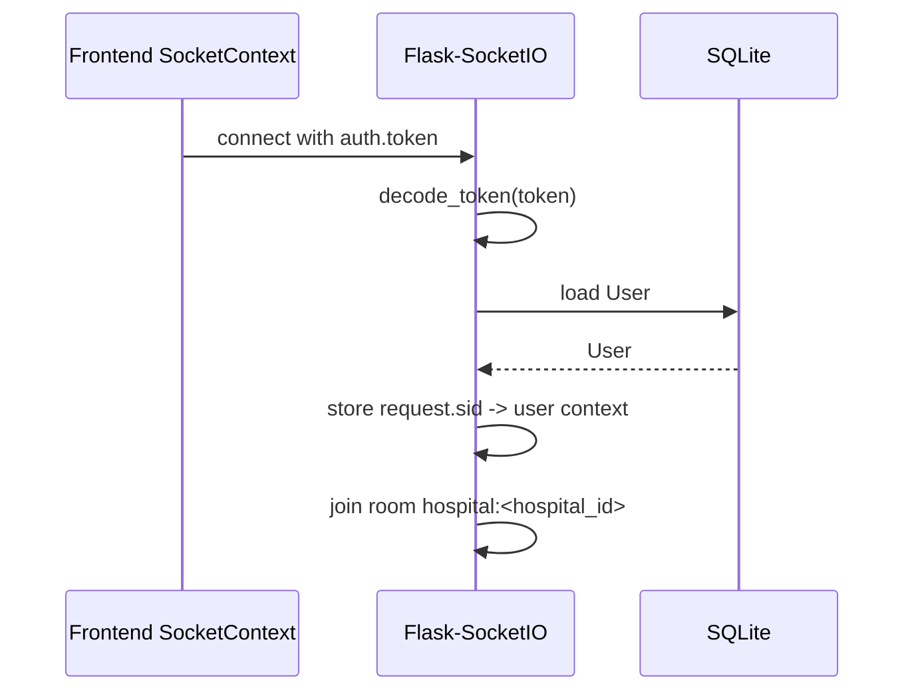

# Backend Architecture

Last reviewed: 2026-06-20

The backend is a Flask application with REST endpoints, Flask-SocketIO real-time events, SQLAlchemy models, JWT-based role/tenant authorization, and optional API key authentication for programmatic access.

## Entry Point

`backend/wsgi.py` is the production entry point — it imports `app` from `app.py` and is served by gunicorn.

`backend/app.py` creates the Flask app and does all of the following:

- Reads backend environment variables via `backend/config.py`.
- Configures CORS.
- Initializes SQLAlchemy.
- Initializes JWT.
- Initializes Flask-Migrate/Alembic.
- Initializes Flask-Caching (SimpleCache or RedisCache).
- Initializes rate limiting (Flask-Limiter, Redis-backed when `REDIS_URL` is set).
- Initializes Prometheus metrics (`/metrics` endpoint).
- Initializes Sentry error tracking when `SENTRY_DSN` is set.
- Initializes Swagger/OpenAPI docs at `{API_PREFIX}/docs/`.
- Initializes Socket.IO (with optional Redis message queue for multi-process).
- Calls `db.create_all()` only when `AUTO_CREATE_TABLES=true` (dev fallback).
- Registers route blueprints.
- Registers domain socket handlers from `services/`.
- Registers usage tracking middleware.
- Runs the dev server when run directly (`python app.py`).

Production path: `gunicorn wsgi:app --bind 0.0.0.0:5000 --workers 4 --config gunicorn.conf.py`

## Backend Folder Structure

```text
backend/
  app.py                # Flask app and socket handler registration
  auth_routes.py        # Auth, doctors, admin users
  auth_utils.py         # JWT/RBAC/tenant/feature-flag helper functions
  audit.py              # Audit log helper (log_action)
  config.py             # Configuration class loading env vars
  api_key.py            # API key generation, hashing, and require_api_key decorator
  api_key_routes.py     # API key CRUD for admin/superadmin
  cache.py              # Flask-Caching cache instance
  celery_app.py         # Celery configuration (Redis broker)
  encryption.py         # Fernet-backed PII encryption (encrypt_value, decrypt_value, EncryptedField)
  fhir.py               # FHIR Observation resource parser
  fhir_routes.py        # FHIR ingestion endpoints (Bundle → LabTest)
  gunicorn.conf.py      # Gunicorn config (JSON access logs)
  hospital_routes.py    # Hospital operations, analytics, queue, billing, file upload
  logging_config.py     # JSON formatter, request ID middleware, response logging
  middleware.py         # Query timeout decorator (SIGALRM-based)
  models.py             # SQLAlchemy models (15 tables)
  notifications.py      # SMS (Twilio) and Email (SendGrid) helpers
  pagination.py         # Pagination utilities (get_pagination_params, paginate, paginated_response)
  patient_routes.py     # Patient-specific APIs (appointments, prescriptions, profile)
  payments_stripe.py    # Stripe PaymentIntent creation and confirmation
  rate_limit.py         # Rate limiting configuration (tenant_key, user_key, limiter)
  seed.py               # Local idempotent seed script, with guarded --reset mode
  superadmin_routes.py  # Superadmin platform-wide stats, hospital CRUD, plan management
  tasks.py              # Celery background tasks (invoice PDF, notifications, webhook delivery)
  telemedicine_routes.py# Telemedicine room management (Jitsi-based)
  upload_service.py     # File upload service (Document model creation)
  usage.py              # In-memory API usage tracker (per-hospital, per-endpoint)
  usage_analytics.py    # Usage analytics from AuditLog
  validation.py         # Request payload validation helpers
  webhook.py            # Webhook dispatch (HMAC-signed, retry logic)
  webhook_routes.py     # Webhook CRUD and delivery history
  wsgi.py               # Gunicorn entry point
  services/             # Domain service layer (socket event handlers)
    __init__.py         # Shared socket helpers and session management
    appointment.py      # Appointment booking, arrival, cancellation
    vitals.py           # Vitals submission
    lab.py              # Lab test prescribing, payment, reporting
    pharmacy.py         # Prescription and dispensing
  migrations/           # Flask-Migrate/Alembic migration repository
   tests/                # Pytest test suite (5 modules)
   pulse_hms.db          # Local SQLite database file
  .env.example          # Environment template
  requirements.txt
  Dockerfile

# Production infrastructure (at repository root)
docker-compose.prod.yml   # Multi-service stack: nginx + backend + postgres + redis + celery + prometheus + grafana
nginx.conf                # nginx reverse proxy config
prometheus.yml            # Prometheus scrape config
grafana/
  datasources/datasource.yml
  dashboards/
    dashboard.yml
    pulse-hms-overview.json
```

## Configuration

Configuration is loaded through `backend/config.py`.

| Variable | Default | Purpose |
| --- | --- | --- |
| `SECRET_KEY` | `pulse-dev-secret` | Flask secret key |
| `JWT_SECRET_KEY` | `pulse-dev-jwt-secret` | JWT signing key |
| `DATABASE_URL` | `sqlite:///backend/pulse_hms.db` equivalent | SQLAlchemy connection string |
| `CORS_ORIGINS` | `http://localhost:5173` | Allowed browser origins |
| `FLASK_ENV` | `development` | Environment label |
| `AUTO_CREATE_TABLES` | `true` locally | Development-only schema bootstrap toggle; must be `false` in production |
| `SOCKET_ASYNC_MODE` | `threading` | Socket.IO async mode (`threading` dev, `gevent` production) |
| `REDIS_URL` | `None` | Redis connection string for rate limiting, caching, socket message queue, and Celery broker |
| `RATELIMIT_ENABLED` | `true` | Enable/disable rate limiting globally |
| `RATELIMIT_DEFAULT` | `200 per day;50 per hour` | Default rate limit spec |
| `ENCRYPTION_KEY` | `None` | Fernet key for PII encryption (required if using EncryptedField) |
| `SENTRY_DSN` | `None` | Sentry error tracking DSN |
| `GUNICORN_WORKERS` | `4` | Number of gunicorn worker processes |
| `QUERY_TIMEOUT_SECONDS` | `10` | Default query timeout (SIGALRM-based) |
| `API_PREFIX` | `/api/v1` | Global API URL prefix |
| `UPLOAD_FOLDER` | `backend/uploads` | File upload storage directory |
| `MAX_CONTENT_LENGTH` | 16 MB | Maximum upload file size |
| `ALLOWED_EXTENSIONS` | pdf, png, jpg, jpeg, doc, docx | Allowed upload file types |
| `CELERY_BROKER_URL` | Falls back to `REDIS_URL` | Celery broker URL |
| `TWILIO_ACCOUNT_SID` | `None` | Twilio account SID for SMS |
| `TWILIO_AUTH_TOKEN` | `None` | Twilio auth token |
| `TWILIO_PHONE_NUMBER` | `None` (mapped from `TWILIO_FROM_NUMBER`) | Twilio sender number |
| `SENDGRID_API_KEY` | `None` | SendGrid API key for email |
| `SENDGRID_FROM_EMAIL` | `None` | SendGrid sender address |
| `STRIPE_SECRET_KEY` | `None` | Stripe secret key (mock mode when unset) |
| `STRIPE_PUBLISHABLE_KEY` | `None` | Stripe publishable key for frontend |
| `JITSI_DOMAIN` | `meet.jit.si` | Telemedicine provider domain (configurable via env) |

## Blueprint Boundaries

```mermaid
flowchart TD
  app[app.py] --> auth[auth_routes.py]
  app --> patient[patient_routes.py]
  app --> hospital[hospital_routes.py]
  app --> superadmin[superadmin_routes.py]
  app --> api_key[api_key_routes.py]
  app --> webhook[webhook_routes.py]
  app --> telemedicine[telemedicine_routes.py]
  app --> fhir[fhir_routes.py]
  app --> socket[Socket.IO handlers in services/]
  app --> usage[usage_analytics.py]

  auth --> models[models.py]
  patient --> models
  hospital --> models
  superadmin --> models
  api_key --> models
  webhook --> models
  telemedicine --> models
  fhir --> models
  socket --> models

  auth --> utils[auth_utils.py]
  patient --> utils
  hospital --> utils
  superadmin --> utils
  api_key --> utils
  webhook --> utils
  telemedicine --> utils
  fhir --> utils

  hospital --> upload[upload_service.py]
  hospital --> pay[payments_stripe.py]
  hospital --> cache[cache.py]

  app --> limiter[rate_limit.py]
  app --> metrics[PrometheusMetrics]
  app --> swagger[Flasgger / Swagger]
```



### `auth_routes.py`

Responsibilities:

- Register hospital workspace and initial admin.
- Register patient account.
- Log in users and issue JWTs.
- Refresh and revoke tokens.
- Change password.
- List doctors for the authenticated tenant.
- Admin user CRUD-like operations.
- Paginated user listing with role/tenant filtering.

Main routes:

- `POST /api/v1/auth/register-hospital`
- `POST /api/v1/auth/register`
- `POST /api/v1/auth/login`
- `POST /api/v1/auth/refresh`
- `POST /api/v1/auth/logout`
- `GET /api/v1/auth/me`
- `PUT /api/v1/auth/change-password`
- `GET /api/v1/auth/doctors`
- `GET /api/v1/auth/doctors/all`
- `GET /api/v1/auth/admin/users`
- `POST /api/v1/auth/admin/users`
- `PUT /api/v1/auth/admin/users/<user_id>`
- `PUT /api/v1/auth/admin/users/<user_id>/deactivate`

### `patient_routes.py`

Responsibilities:

- Patient appointment history.
- Patient prescriptions.
- Patient profile updates.

Main routes:

- `GET /api/v1/patients/<patient_id>/appointments`
- `GET /api/v1/patients/<patient_id>/prescriptions`
- `PUT /api/v1/patients/<patient_id>/profile`

### `hospital_routes.py`

Responsibilities:

- Admin analytics and search.
- Staff queue.
- Doctor queue and stats.
- Lab and pharmacy queues.
- Ratings.
- Availability and appointment slots.
- Clinical notes.
- Rescheduling.
- Invoice and payment state (cash and online).
- Clinical summaries.
- File upload/download for lab reports.

Main routes:

- `GET /api/v1/hospital/admin/analytics`
- `GET /api/v1/hospital/queue`
- `GET /api/v1/hospital/doctor/<doc_id>/queue`
- `GET /api/v1/hospital/doctor/<doc_id>/stats`
- `GET /api/v1/hospital/lab/queue`
- `GET /api/v1/hospital/patient/<patient_id>/tests`
- `GET /api/v1/hospital/pharmacy/queue`
- `POST /api/v1/hospital/rating`
- `PUT /api/v1/hospital/doctor/<doc_id>/availability`
- `GET /api/v1/hospital/doctor/<doc_id>/slots`
- `PUT /api/v1/hospital/appointment/<appt_id>/notes`
- `GET /api/v1/hospital/appointment/<appt_id>/notes`
- `PUT /api/v1/hospital/appointment/<appt_id>/reschedule`
- `POST /api/v1/hospital/appointment/<appt_id>/invoice`
- `GET /api/v1/hospital/patient/<patient_id>/invoices`
- `PUT /api/v1/hospital/invoice/<inv_id>/pay`
- `POST /api/v1/hospital/invoice/<inv_id>/create-payment-intent`
- `POST /api/v1/hospital/invoice/<inv_id>/confirm-online-payment`
- `GET /api/v1/hospital/appointment/<appt_id>/summary`
- `GET /api/v1/hospital/admin/search`
- `POST /api/v1/hospital/lab/upload`
- `GET /api/v1/hospital/lab/documents/<doc_id>`
- `GET /api/v1/hospital/lab/test/<test_id>/documents`

### `superadmin_routes.py`

Responsibilities:

- Platform-wide stats (hospitals, users, appointments, revenue).
- Hospital CRUD (create, read, update, list) — plan assignment, feature flags.
- Hospital user listing with pagination.
- Plan-based feature flag auto-sync on plan change.

Main routes:

- `GET /api/v1/superadmin/stats`
- `GET /api/v1/superadmin/hospitals`
- `GET /api/v1/superadmin/hospitals/<hospital_id>`
- `POST /api/v1/superadmin/hospitals`
- `PUT /api/v1/superadmin/hospitals/<hospital_id>`
- `GET /api/v1/superadmin/hospitals/<hospital_id>/users`

### `api_key_routes.py`

Responsibilities:

- API key generation and management for programmatic access.

Main routes (under `/api/v1/auth`):

- `GET /api/v1/auth/admin/api-keys`
- `POST /api/v1/auth/admin/api-keys`
- `PUT /api/v1/auth/admin/api-keys/<key_id>`
- `DELETE /api/v1/auth/admin/api-keys/<key_id>`

### `webhook_routes.py`

Responsibilities:

- Webhook endpoint CRUD for outgoing event notifications.

Main routes (under `/api/v1/auth`):

- `GET /api/v1/auth/admin/webhooks`
- `POST /api/v1/auth/admin/webhooks`
- `PUT /api/v1/auth/admin/webhooks/<webhook_id>`
- `DELETE /api/v1/auth/admin/webhooks/<webhook_id>`
- `GET /api/v1/auth/admin/webhooks/<webhook_id>/deliveries`
- `GET /api/v1/auth/admin/webhooks/events`
- `POST /api/v1/auth/admin/webhooks/test`

### `telemedicine_routes.py`

Responsibilities:

- Teleconsultation room creation, listing, and lifecycle management.

Main routes (under `/api/v1/hospital`):

- `POST /api/v1/hospital/telemedicine/rooms`
- `GET /api/v1/hospital/telemedicine/rooms`
- `POST /api/v1/hospital/telemedicine/rooms/<room_id>/start`
- `POST /api/v1/hospital/telemedicine/rooms/<room_id>/end`
- `PUT /api/v1/hospital/telemedicine/rooms/<room_id>/notes`

### `fhir_routes.py`

Responsibilities:

- FHIR Observation bundle ingestion (parses HL7 FHIR R4 format into LabTest records).

Main routes (under `/api/v1/hospital`):

- `POST /api/v1/hospital/fhir/observations`
- `GET /api/v1/hospital/fhir/metadata`

### System Routes

- `GET /api/v1/ping` — Health check
- `GET /api/v1/health` — Health check with database status
- `GET /api/v1/health/db` — Database health check
- `GET /api/v1/admin/usage` — Usage analytics from audit log
- `GET /api/v1/admin/usage/live` — Live in-memory usage tracker
- `GET /api/v1/swagger.json` — OpenAPI spec
- `GET /api/v1/docs/` — Swagger UI
- `GET /metrics` — Prometheus metrics

## Authentication And Authorization

### JWT Authentication

Authentication uses `flask-jwt-extended`.

Token creation:

- `auth_routes.py` creates access tokens (30 min expiry) and refresh tokens (30 day expiry).
- JWT identity is the user id as a string.
- Additional JWT claims are:
  - `role`
  - `hospital_id`

Authorization helpers live in `auth_utils.py`:

- `current_user()`
- `current_role()`
- `current_hospital_id()`
- `require_roles(...)`
- `require_hospital_context()`
- `tenant_get(...)`
- `same_tenant(...)`
- `tenant_filter(...)`
- `is_superadmin()`
- `forbidden()`

Routes use `@require_roles(...)` for protected endpoints. Public endpoints are hospital registration, patient registration, login, and ping/health.

### API Key Authentication

`backend/api_key.py` provides an alternative `@require_api_key` decorator for programmatic access via `Authorization: Bearer <pk_...>` headers. API keys are generated as `pk_`-prefixed tokens, hashed with SHA-256, and stored alongside scopes, expiry, and last-used timestamps.

Key management (CRUD) is restricted to `admin` and `superadmin` roles.

## Tenant Isolation

Tenant isolation is implemented with `hospital_id`.

Current pattern:

```python
Appointment.query.filter_by(hospital_id=current_hospital_id(), ...)
```

For id lookups:

```python
appt = tenant_get(Appointment, appt_id)
```

Superadmin handling exists in helpers, but most tenant routes still use `current_hospital_id()` directly and are mainly scoped for hospital users.

## Socket.IO Layer

Socket.IO handlers are organized as domain service modules in `backend/services/`.

| Module | Handlers | Roles |
| --- | --- | --- |
| `services/appointment.py` | `action_book_appointment`, `action_arrive`, `action_cancel_appointment` | patient, staff, admin |
| `services/vitals.py` | `action_submit_vitals` | staff, admin |
| `services/lab.py` | `action_prescribe_test`, `action_pay_test`, `action_upload_test_report` | doctor, patient, staff, admin |
| `services/pharmacy.py` | `action_prescribe_meds`, `action_dispense_meds` | doctor, staff, admin |

`services/__init__.py` provides shared helpers (`require_socket_roles`, `socket_payload`, `tenant_appointment`, etc.) and manages `socket_sessions`.

Connection flow:



Socket session data is stored in `services.socket_sessions`.
Local/test Socket.IO uses `SOCKET_ASYNC_MODE=threading`; production uses `gevent` with Redis message queue for multi-process scaling.

Tenant room naming:

```text
hospital:<hospital_id>
```

Socket event handlers validate roles before mutating data:

- `patient`: book, arrive, cancel, pay own lab test.
- `staff`: submit vitals, upload lab report, dispense meds, queue actions.
- `doctor`: prescribe tests and meds for own appointments.
- `admin`: broad operational access within tenant.

## Data Models

Models are defined in `backend/models.py` (15 tables).

### Hospital

Tenant/workspace record.

Fields include:

- `id`
- `name`
- `subdomain` (unique)
- `plan` (trial, basic, pro, enterprise)
- `feature_flags` (JSON, auto-synced on plan change)
- `is_active`
- `created_at`

### User

Shared user table for patients, doctors, staff, admins, and superadmins.

Fields include:

- Tenant and auth: `hospital_id`, `role`, `name`, `email`, `contact`, `password`, `is_active`, `password_changed_at`
- Patient profile: `age`, `gender`, `blood_type`, `height`, `weight_baseline`, `allergies`
- Doctor profile: `specialization`, `qualification`, `experience_years`, `consultation_fee`, `bio`, `is_available`

Unique constraints: `(hospital_id, email)`, `(hospital_id, contact)`.

### RefreshToken

Stores hashed refresh tokens for rotation and revocation.

Fields include: `user_id`, `token_hash`, `expires_at`, `is_revoked`, `created_at`.

### Appointment

Visit/queue record.

Fields include:

- `hospital_id`
- `patient_id`
- `doctor_id`
- `date_str`
- `time_str`
- `status`
- `symptoms`
- `pain_level`
- `followup_days`
- `clinical_notes`

### Vitals

Vitals captured during visit intake. Unique per `(hospital_id, appointment_id)`.

### LabTest

Lab order/result record.

### Prescription

Medication instructions from doctor.

### Rating

Patient visit rating (1-5 stars). Unique per `(hospital_id, appointment_id)`.

### Invoice

Simplified billing record with consultation, lab, pharmacy, total, and status fields. Unique per `(hospital_id, appointment_id)`.

### Payment

Payment tracking record created when an invoice is paid.

Fields include:

- `hospital_id`
- `invoice_id`
- `patient_id`
- `amount`
- `method` (cash, card, online, insurance)
- `transaction_id` (auto-generated as `TXN{timestamp}{invoice_id}` for cash, Stripe `pi_` for online)
- `status` (pending, completed, failed, refunded)
- `paid_at`

### Document

File upload record for lab reports, invoices, etc.

Fields include:

- `hospital_id`
- `lab_test_id` (nullable, FK to linked lab test)
- `patient_id`
- `uploaded_by`
- `filename` (secure UUID-based storage name)
- `original_name`
- `content_type`
- `file_size`
- `description`
- `uploaded_at`

### ApiKey

Programmatic access keys.

Fields include:

- `hospital_id`
- `user_id` (creator)
- `name`
- `key_hash` (SHA-256 of raw key)
- `key_prefix` (first 7 chars, e.g. `pk_abcd`)
- `scopes` (JSON array)
- `is_active`
- `last_used_at`
- `expires_at`
- `created_at`

### Webhook

Outgoing webhook endpoint configuration.

Fields include:

- `hospital_id`
- `name`
- `url`
- `secret` (auto-generated HMAC signing secret)
- `events` (JSON array of event types)
- `is_active`
- `retry_count` (default 3)
- `timeout_seconds` (default 10)
- `created_at`

### WebhookDelivery

Delivery attempt log for each webhook event.

Fields include:

- `webhook_id`
- `event`
- `payload` (JSON)
- `status` (pending, delivered, retrying, failed)
- `response_code`
- `response_body`
- `attempts`
- `next_retry_at`
- `created_at`

### Teleconsultation

Telemedicine room record.

Fields include:

- `hospital_id`
- `appointment_id`
- `doctor_id`
- `patient_id`
- `room_name` (unique)
- `provider` (default: `jitsi`)
- `status` (scheduled, in_progress, completed)
- `scheduled_at`
- `started_at`
- `ended_at`
- `meeting_url` (auto-generated from provider domain)
- `recording_url`
- `notes`
- `created_at`

### AuditLog

Clinical and billing action audit record.

Fields include:

- `hospital_id`
- `user_id`
- `action`
- `resource_type`
- `resource_id`
- `details` (JSON text)
- `ip_address`
- `request_id`
- `created_at`

## Workflow State

Appointment status values are string fields, not database enums.

Observed statuses include:

- `Scheduled`
- `Arrived`
- `Vitals_Taken`
- `Lab_Pending`
- `Consult_Pending_Review`
- `Completed`
- `Cancelled`

Lab statuses include:

- `Pending Payment`
- `Paid - Needs Sample`
- `Completed`

Prescription statuses include:

- `Pending Dispense`
- `Dispensed`

Invoice statuses include:

- `Unpaid`
- `Paid`

Payment statuses include:

- `pending`
- `completed`
- `failed`
- `refunded`

Teleconsultation statuses include:

- `scheduled`
- `in_progress`
- `completed`

Webhook delivery statuses include:

- `pending`
- `delivered`
- `retrying`
- `failed`

## Audit Logging

The `backend/audit.py` module provides `log_action()` for recording clinical and billing actions.

Audit records are created non-blocking — the primary operation always completes regardless of audit write outcome. Each audit record includes hospital_id, user_id, action name, resource type/id, a JSON details blob, ip_address, and request_id.

Audited actions:

- Invoice payment (amount, method, transaction_id, payment_id)
- Online payment confirmation
- User creation and updates
- User deactivation/reactivation
- Hospital CRUD (superadmin)
- Lab report uploads
- (Expandable to all clinical/billing mutations)

## Request ID And Logging

The app middleware auto-generates a `X-Request-ID` header if not present in the incoming request. This ID is propagated through response headers and included in structured log messages via `logging_config.py`.

Logging supports JSON-format output (default) and plain-text format. Gunicorn access logs also support JSON format via `gunicorn.conf.py`.

Response headers include:

- `X-Request-ID` — unique request identifier
- `X-Response-Time` — server-side processing duration in seconds
- `X-Content-Type-Options: nosniff`
- `X-Frame-Options: DENY`
- `X-XSS-Protection: 0`
- `Strict-Transport-Security` (production)
- `Cache-Control: no-store`

## Rate Limiting

Rate limiting is configured via `backend/rate_limit.py` using Flask-Limiter.

- Default limits: `200 per day; 50 per hour` per IP.
- Blueprint-level limits: `100 per minute` (patient, hospital), `60 per minute` (superadmin).
- Tenant-aware key function (`tenant_key`) scopes limits per-hospital when a JWT is present.
- Redis-backed storage when `REDIS_URL` is set; in-memory otherwise.
- Per-tenant rate limits for data-heavy endpoints (file upload: `10 per minute`).
- Registration endpoints are throttled (`3 per hour` for hospital registration, `5 per hour` for patient registration).

## Pagination

`backend/pagination.py` provides pagination utilities used across all list endpoints:

- `get_pagination_params()` — extracts optional `page`/`per_page` from query args (max 200 per page).
- `paginate(query, page, per_page)` — applies LIMIT/OFFSET and returns `(items, total, page, per_page, pages)`.
- `paginated_response(items, total, page, per_page, pages)` — wraps items with `X-Total-Count`, `X-Page`, `X-Per-Page`, `X-Pages` headers.

## Celery Background Tasks

`backend/celery_app.py` configures a Celery instance with Redis as broker/backend.

Tasks defined in `backend/tasks.py`:

- `generate_invoice_pdf(invoice_id, hospital_id)` — generates a PDF invoice via reportlab, saves to uploads, creates a Document record.
- `send_notification(notification_type, recipient_id, payload)` — dispatches SMS/email via `notifications.py`.
- `async_deliver_webhook(delivery_id)` — delivers a pending webhook with retry support.

Production Celery worker runs via: `celery -A celery_app worker --loglevel=info --concurrency=2`

## Caching

`backend/cache.py` provides a `Cache` instance backed by `Flask-Caching`.

- Development: `SimpleCache` (in-memory).
- Production (when `REDIS_URL` is set): `RedisCache`.
- Used for admin analytics and superadmin stats with configurable TTLs.

## Encryption

`backend/encryption.py` provides Fernet symmetric encryption for PII fields.

- `encrypt_value(value)` / `decrypt_value(token)` — explicit encrypt/decrypt.
- `EncryptedField` — transparent SQLAlchemy type decorator that encrypts on write, decrypts on read.
- Key derived from `ENCRYPTION_KEY` via PBKDF2HMAC (SHA-256, 600k iterations).

## File Uploads

`backend/upload_service.py` handles file uploads with validation:

- Allowed file types configurable via `ALLOWED_EXTENSIONS`.
- Max file size via `MAX_CONTENT_LENGTH` (16 MB).
- Files stored with UUID-based names to prevent collision.
- Document records linked to hospital, patient, lab test.
- Lab report upload endpoint (`POST /api/v1/hospital/lab/upload`) transitions lab test to `Completed` status.

## Observability

### Sentry

Error tracking initialized in `app.py` when `SENTRY_DSN` is set. Traces sampled at 20%.

### Prometheus

`/metrics` endpoint exposed via `prometheus_flask_exporter`. Scraped by Prometheus at `backend:5000` (configured in `prometheus.yml`).

### Grafana

Dashboard provisioning at `grafana/dashboards/pulse-hms-overview.json` with Prometheus datasource.

## Deployment

### Development

```bash
docker compose up
```

- Builds backend from `backend/`.
- Exposes `5000:5000`.
- Mounts `./backend:/app`.
- Uses SQLite and threading mode.

### Production

```bash
docker compose -f docker-compose.prod.yml up
```

Multi-service stack:

- **nginx**: Reverse proxy, serves frontend static assets.
- **backend**: Flask app via gunicorn (gevent workers, JSON access logs).
- **db**: PostgreSQL 16.
- **redis**: Redis 7 (rate limiting, caching, socket message queue, Celery broker).
- **celery-worker**: Celery worker for async tasks.
- **prometheus**: Prometheus 2.55 for metrics collection.
- **grafana**: Grafana 11 for dashboards.

Backend Dockerfile:

- Multi-stage build (builder + runtime).
- Base: `python:3.10-slim`.
- Runs as non-root `pulse` user.
- Health check: `GET /api/health`.
- Entrypoint: `gunicorn wsgi:app --bind 0.0.0.0:5000 --workers 4 --config gunicorn.conf.py`.

## Testing And CI/CD

Current backend state:

- Pytest is configured in `pytest.ini`.
- Backend tests live in `backend/tests/` — 54 tests across 5 modules:
  - `test_api.py` — 7 API tests (auth, tenant, validation, invoice, rating)
  - `test_socket.py` — 5 socket event tests (workflow mutations)
  - `test_workflow.py` — 17 workflow integration tests (end-to-end appointment/lab/pharmacy)
  - `test_integrations.py` — 25 integration tests (expanded role coverage, edge cases, safe_commit, tenant isolation, Jitsi config)
  - `conftest.py` — fixtures and app factory
- GitHub Actions CI runs on push/PR to `main`:
  - `lint-format.yml` — ruff check + ESLint
  - `test.yml` — pytest (54 tests) + frontend build + typecheck
  - `security-scan.yml` — ruff security rules + pip-audit + Trivy
  - `docker-build.yml` — multi-stage Docker image build validation
- Migration checks run with `flask --app backend/app.py db -d backend/migrations check`.
- Pre-commit config exists in `.pre-commit-config.yaml` (ruff, trailing-whitespace, end-of-file-fixer, check-yaml).

## Backend Weaknesses

Canonical detailed list: `docs/architectural-weaknesses.md`.

Backend-specific highlights:

- ~~Socket.IO handlers extracted from `backend/app.py` into `backend/services/`~~ — **Done**
- ~~Flask-Migrate/Alembic is initialized in `backend/migrations`~~ — **Done**
- ~~Startup schema creation is controlled by `AUTO_CREATE_TABLES`~~ — **Done, retained as dev fallback**
- ~~Audit logging is absent for clinical and billing actions~~ — **Done**
- ~~No standardized error response shape across all endpoints~~ — **Done, `error_response()`/`success_response()` in validation.py**
- ~~Request validation is a small local helper module, not a full schema library~~ — **Partially addressed with zod-adjacent validation helpers**
- ~~Backend tests exist (29) but are still narrow~~ — **Expanded to 54 tests across 5 modules**
- SQLite is used as the active database (PostgreSQL available in production Docker Compose).
- ~~Models use foreign keys but no SQLAlchemy relationship properties~~ — **Phase 18 added relationships + fixed N+1 queries**
- Socket sessions are in memory, so multi-process scaling would need Redis-backed session store.
- ~~Telemedicine provider domain (JITSI_DOMAIN) is hardcoded, not configurable via env var~~ — **Now configurable via JITSI_DOMAIN env**
- No webhook replay capability — failed deliveries require manual retry.
- No rate limit alerting or automatic IP ban for abuse.
- API usage tracker (usage.py) is in-memory only — resets on process restart.

## Suggested Backend Improvements

- Add unit tests for service module functions.
- Add tests for each role and tenant boundary.
- Add request schemas with Marshmallow, Pydantic, or similar.
- ~~Add structured logging and audit logs~~ — **Done**
- Replace SQLite with PostgreSQL for production.
- ~~Add relationship properties and continue refining constraints/indexes as workflows mature~~ — **Done (Phase 18)**
- Replace string statuses with enums/constants.
- Add Redis-backed socket session store before scaling Socket.IO horizontally.
- Add standardized error response helper (Partially done — shared helpers exist in validation.py).
- Add PostgreSQL service to CI for database-backend tests.
- Add webhook replay/re-delivery UI.
- Add rate limit monitoring and automatic abuse detection.
- Persist API usage tracker to database or Redis.
