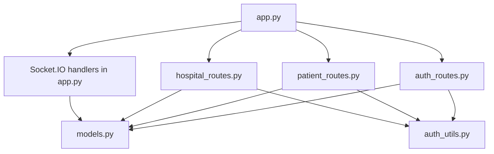
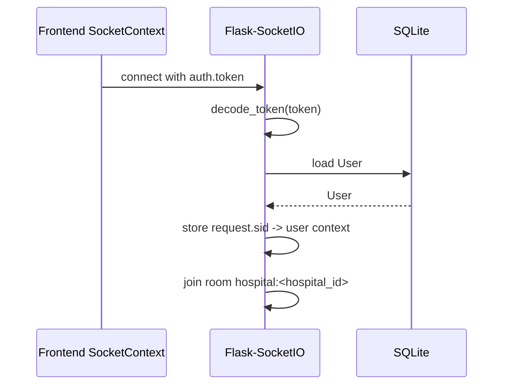

# Backend Architecture

Last reviewed: 2026-06-15

The backend is a Flask application with REST endpoints, Flask-SocketIO real-time events, SQLAlchemy models, and JWT-based role/tenant authorization.

## Entry Point

`backend/app.py` is the backend entry point.

It currently does all of the following:

- Creates the Flask app.
- Reads backend environment variables.
- Configures CORS.
- Initializes SQLAlchemy.
- Initializes JWT.
- Initializes Socket.IO.
- Calls `db.create_all()` only when `AUTO_CREATE_TABLES=true`.
- Registers route blueprints.
- Registers domain socket handlers from `services/`.
- Starts the dev server when run directly.

## Backend Folder Structure

```text
backend/
  app.py             # Flask app and socket handler registration
  auth_routes.py     # Auth, doctors, admin users
  auth_utils.py      # JWT/RBAC/tenant helper functions
  audit.py           # Audit log helper (log_action)
  config.py          # Configuration class loading env vars
  hospital_routes.py # Hospital operations and billing APIs
  patient_routes.py  # Patient-specific APIs
  models.py          # SQLAlchemy models (10 tables)
  seed.py            # Local idempotent seed script, with guarded --reset mode
  validation.py      # Request payload validation helpers
  services/          # Domain service layer (socket event handlers)
    __init__.py      # Shared socket helpers and session management
    appointment.py   # Appointment booking, arrival, cancellation
    vitals.py        # Vitals submission
    lab.py           # Lab test prescribing, payment, reporting
    pharmacy.py      # Prescription and dispensing
  migrations/        # Flask-Migrate/Alembic migration repository
  tests/             # Pytest test suite
  pulse_hms.db       # Local SQLite database file
  requirements.txt
  Dockerfile
  .env.example
```

## Configuration

Configuration is loaded through `backend/config.py`.

| Variable | Default | Purpose |
| --- | --- | --- |
| `SECRET_KEY` | `pulse-dev-secret` | Flask secret key |
| `JWT_SECRET_KEY` | `pulse-dev-jwt-secret` | JWT signing key |
| `DATABASE_URL` | `sqlite:///backend/pulse_hms.db` equivalent | SQLAlchemy connection string |
| `CORS_ORIGINS` | `http://localhost:5173` | Allowed browser origins |
| `FLASK_ENV` | Set by Compose | Environment label |
| `AUTO_CREATE_TABLES` | `true` locally | Development-only schema bootstrap toggle; must be `false` in production |

## Blueprint Boundaries



### `auth_routes.py`

Responsibilities:

- Register hospital workspace and initial admin.
- Register patient account.
- Log in users and issue JWTs.
- List doctors for the authenticated tenant.
- Admin user CRUD-like operations.

Main routes:

- `POST /api/auth/register-hospital`
- `POST /api/auth/register`
- `POST /api/auth/login`
- `GET /api/auth/doctors`
- `GET /api/auth/doctors/all`
- `GET /api/auth/admin/users`
- `POST /api/auth/admin/users`
- `PUT /api/auth/admin/users/<user_id>`
- `PUT /api/auth/admin/users/<user_id>/deactivate`

### `patient_routes.py`

Responsibilities:

- Patient appointment history.
- Patient prescriptions.
- Patient profile updates.

Main routes:

- `GET /api/patients/<patient_id>/appointments`
- `GET /api/patients/<patient_id>/prescriptions`
- `PUT /api/patients/<patient_id>/profile`

### `hospital_routes.py`

Responsibilities:

- Admin analytics and search.
- Staff queue.
- Doctor queue and stats.
- Lab and pharmacy queues.
- Ratings.
- Availability and appointment slots.
- Clinical notes.
- Rescheduling.
- Invoice and payment state.
- Clinical summaries.

Main routes:

- `GET /api/hospital/admin/analytics`
- `GET /api/hospital/queue`
- `GET /api/hospital/doctor/<doc_id>/queue`
- `GET /api/hospital/doctor/<doc_id>/stats`
- `GET /api/hospital/lab/queue`
- `GET /api/hospital/patient/<patient_id>/tests`
- `GET /api/hospital/pharmacy/queue`
- `POST /api/hospital/rating`
- `PUT /api/hospital/doctor/<doc_id>/availability`
- `GET /api/hospital/doctor/<doc_id>/slots`
- `PUT /api/hospital/appointment/<appt_id>/notes`
- `GET /api/hospital/appointment/<appt_id>/notes`
- `PUT /api/hospital/appointment/<appt_id>/reschedule`
- `POST /api/hospital/appointment/<appt_id>/invoice`
- `GET /api/hospital/patient/<patient_id>/invoices`
- `PUT /api/hospital/invoice/<inv_id>/pay`
- `GET /api/hospital/appointment/<appt_id>/summary`
- `GET /api/hospital/admin/search`

## Authentication And Authorization

Authentication uses `flask-jwt-extended`.

Token creation:

- `auth_routes.py` creates access tokens.
- JWT identity is the user id as a string.
- Additional JWT claims are:
  - `role`
  - `hospital_id`

Authorization helpers live in `auth_utils.py`:

- `current_user()`
- `current_role()`
- `current_hospital_id()`
- `require_roles(...)`
- `tenant_get(...)`
- `same_tenant(...)`
- `tenant_filter(...)`

Routes use `@require_roles(...)` for protected endpoints. Public endpoints are hospital registration, patient registration, login, and ping.

## Tenant Isolation

Tenant isolation is implemented with `hospital_id`.

Current pattern:

```python
Appointment.query.filter_by(hospital_id=current_hospital_id(), ...)
```

For id lookups:

```python
appt = tenant_get(Appointment, appt_id)
```

Superadmin handling exists in helpers, but most tenant routes still use `current_hospital_id()` directly and are mainly scoped for hospital users.

## Socket.IO Layer

Socket.IO handlers are organized as domain service modules in `backend/services/`.

| Module | Handlers | Roles |
| --- | --- | --- |
| `services/appointment.py` | `action_book_appointment`, `action_arrive`, `action_cancel_appointment` | patient, staff, admin |
| `services/vitals.py` | `action_submit_vitals` | staff, admin |
| `services/lab.py` | `action_prescribe_test`, `action_pay_test`, `action_upload_test_report` | doctor, patient, staff, admin |
| `services/pharmacy.py` | `action_prescribe_meds`, `action_dispense_meds` | doctor, staff, admin |

`services/__init__.py` provides shared helpers (`require_socket_roles`, `socket_payload`, `tenant_appointment`, etc.) and manages `socket_sessions`.

Connection flow:



Socket session data is stored in `services.socket_sessions`.
Local/test Socket.IO uses `SOCKET_ASYNC_MODE=threading`; production deployment strategy is still pending.

Tenant room naming:

```text
hospital:<hospital_id>
```

Socket event handlers validate roles before mutating data:

- `patient`: book, arrive, cancel, pay own lab test.
- `staff`: submit vitals, upload lab report, dispense meds, queue actions.
- `doctor`: prescribe tests and meds for own appointments.
- `admin`: broad operational access within tenant.

## Data Models

Models are defined in `backend/models.py`.

### Hospital

Tenant/workspace record.

Fields include:

- `id`
- `name`
- `subdomain`
- `plan`
- `is_active`
- `created_at`

### User

Shared user table for patients, doctors, staff, admins, and superadmins.

Fields include:

- Tenant and auth: `hospital_id`, `role`, `name`, `email`, `contact`, `password`, `is_active`
- Patient profile: `age`, `gender`, `blood_type`, `height`, `weight_baseline`, `allergies`
- Doctor profile: `specialization`, `qualification`, `experience_years`, `consultation_fee`, `bio`, `is_available`

### Appointment

Visit/queue record.

Fields include:

- `hospital_id`
- `patient_id`
- `doctor_id`
- `date_str`
- `time_str`
- `status`
- `symptoms`
- `pain_level`
- `followup_days`
- `clinical_notes`

### Vitals

Vitals captured during visit intake.

### LabTest

Lab order/result record.

### Prescription

Medication instructions from doctor.

### Rating

Patient visit rating.

### Invoice

Simplified billing record with consultation, lab, pharmacy, total, and status fields.

### Payment

Payment tracking record created when an invoice is paid.

Fields include:

- `hospital_id`
- `invoice_id`
- `patient_id`
- `amount`
- `method` (default: `cash`)
- `transaction_id` (auto-generated as `TXN{timestamp}{invoice_id}`)
- `status` (default: `completed`)
- `paid_at` (default: UTC now)

Indexed on `(hospital_id, invoice_id)` and `(hospital_id, patient_id)`.

### AuditLog

Clinical and billing action audit record.

Fields include:

- `hospital_id`
- `user_id`
- `action`
- `resource_type`
- `resource_id`
- `details` (JSON blob)
- `created_at`

Indexed on `(hospital_id, created_at)`, `(user_id)`, and `(resource_type, resource_id)`.

## Workflow State

Appointment status values are string fields, not database enums.

Observed statuses include:

- `Scheduled`
- `Arrived`
- `Vitals_Taken`
- `Lab_Pending`
- `Consult_Pending_Review`
- `Completed`
- `Cancelled`

Lab statuses include:

- `Pending Payment`
- `Paid - Needs Sample`
- `Completed`

Prescription statuses include:

- `Pending Dispense`
- `Dispensed`

Invoice statuses include:

- `Unpaid`
- `Paid`

Payment statuses include:

- `completed`
- `pending`
- `failed`
- `refunded`

## Audit Logging

The `backend/audit.py` module provides `log_action()` for recording clinical and billing actions.

Audit records are created non-blocking — the primary operation always completes regardless of audit write outcome. Each audit record includes hospital_id, user_id, action name, resource type/id, and a JSON details blob.

Audited actions:

- Invoice payment (amount, method, transaction_id, payment_id)
- (Expandable to all clinical/billing mutations)

## Request ID And Logging

The app middleware auto-generates a `X-Request-ID` header if not present in the incoming request. This ID is propagated through response headers and included in structured log messages via the app's logging configuration.

## Deployment

Backend Dockerfile:

- Uses `python:3.10-slim`.
- Installs `requirements.txt`.
- Copies app files.
- Runs `python app.py`.

Docker Compose:

- Builds backend from `backend/`.
- Exposes `5000:5000`.
- Mounts `./backend:/app`.
- Passes development env vars.

This is currently a development deployment flow, not a production server setup.

## Testing And CI/CD

Current backend state:

- Pytest is configured in `pytest.ini`.
- Backend tests live in `backend/tests/` — 29 tests across 3 modules:
  - 7 API tests (auth, tenant, validation, invoice, rating)
  - 6 socket event tests (workflow mutations)
  - 16 workflow integration tests (end-to-end appointment/lab/pharmacy)
- GitHub Actions CI runs on push/PR to `main`:
  - `.github/workflows/ci.yml` initial single workflow.
  - Split into 4 focused workflows:
    - `lint-format.yml` — ruff check + ESLint
    - `test.yml` — pytest (29 tests) + frontend build
    - `security-scan.yml` — ruff security rules + pip-audit + Trivy
    - `docker-build.yml` — multi-stage Docker image build validation
- Migration checks run with `flask --app backend/app.py db -d backend/migrations check`.
- Pre-commit config exists in `.pre-commit-config.yaml` (ruff, trailing-whitespace, end-of-file-fixer, check-yaml).

## Backend Weaknesses

Canonical detailed list: `docs/architectural-weaknesses.md`.

Backend-specific highlights:

- ~~Socket.IO handlers extracted from `backend/app.py` into `backend/services/`~~ — **Done**
- ~~Flask-Migrate/Alembic is initialized in `backend/migrations`~~ — **Done**
- ~~Startup schema creation is controlled by `AUTO_CREATE_TABLES`~~ — **Done, retained as dev fallback**
- SQLite is used as the active database.
- Backend tests exist (29) but are still narrow.
- Request validation is currently a small local helper module, not a full schema library.
- No standardized error response shape across all endpoints.
- Models use foreign keys but no SQLAlchemy relationship properties.
- Socket sessions are in memory, so multi-process scaling would need redesign.
- ~~Audit logging is absent for clinical and billing actions~~ — **Done**

## Suggested Backend Improvements

- Add unit tests for service module functions.
- Add tests for each role and tenant boundary.
- Add request schemas with Marshmallow, Pydantic, or similar.
- ~~Add structured logging and audit logs~~ — **Done**
- Replace SQLite with PostgreSQL for production.
- Add relationship properties and continue refining constraints/indexes as workflows mature.
- Replace string statuses with enums/constants.
- Add Redis/message queue support before scaling Socket.IO horizontally.
- Add standardized error response helper.
- Add PostgreSQL service to CI for database-backend tests.
