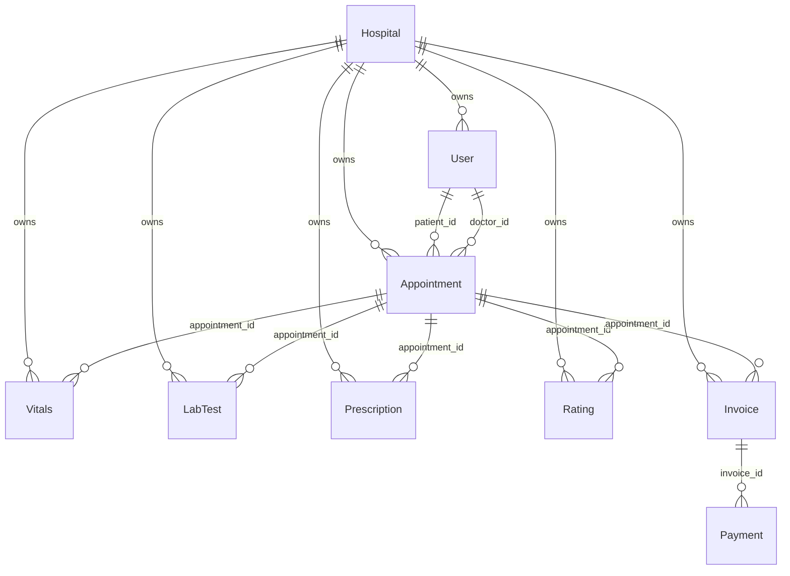

# Database Documentation

Last reviewed: 2026-06-15

This document describes the current SQLAlchemy model layer in `backend/models.py`.

## Current Database

- Engine in local development: SQLite (`backend/pulse_hms.db`)
- Engine in production: PostgreSQL (via `DATABASE_URL` env var)
- ORM: Flask-SQLAlchemy
- Schema creation (legacy): `db.create_all()` when `AUTO_CREATE_TABLES=true`
- Schema creation (recommended): `flask db upgrade` via Alembic migrations
- Seed: `backend/seed.py` upserts local demo data
- Reset: `backend/seed.py --reset` drops and recreates local SQLite tables after safety checks
- Migrations: Flask-Migrate/Alembic — baseline migration in `backend/migrations/versions/`
- Current migration head: `e7f242c6b558` (adds Payment table)

## Model Overview

Important note: the code declares foreign keys but does not define SQLAlchemy relationship properties. Route code manually queries related records.

## Tables

### `hospital`

Tenant/workspace table.

| Column | Type | Notes |
| --- | --- | --- |
| `id` | Integer PK | Tenant id |
| `name` | String(100) | Required |
| `subdomain` | String(50) | Unique, required |
| `plan` | String(50) | Defaults to `trial` |
| `is_active` | Boolean | Defaults true |
| `created_at` | DateTime | Defaults UTC now |

### `user`

Shared table for patients, doctors, staff, admins, and superadmins.

| Column | Type | Notes |
| --- | --- | --- |
| `id` | Integer PK | User id |
| `hospital_id` | FK hospital.id | Required tenant ownership |
| `role` | String(20) | `patient`, `doctor`, `staff`, `admin`, `superadmin` |
| `name` | String(100) | Required |
| `email` | String(120) | Nullable |
| `contact` | String(20) | Nullable |
| `password` | String(200) | Nullable; stores Werkzeug password hashes |
| `age` | Integer | Patient profile |
| `gender` | String(20) | Patient profile |
| `blood_type` | String(10) | Patient profile |
| `height` | String(20) | Patient profile |
| `weight_baseline` | String(20) | Patient profile |
| `allergies` | Text | Patient profile |
| `specialization` | String(100) | Doctor profile |
| `qualification` | String(200) | Doctor profile |
| `experience_years` | Integer | Doctor profile |
| `consultation_fee` | Float | Doctor profile |
| `bio` | Text | Doctor profile |
| `is_available` | Boolean | Doctor availability |
| `is_active` | Boolean | Soft-delete/status flag |

Constraints and indexes:

- Unique: `(hospital_id, email)`
- Unique: `(hospital_id, contact)`
- Index: `(hospital_id, role)`
- Index: `(hospital_id, is_active)`

### `appointment`

Appointment and workflow state table.

| Column | Type | Notes |
| --- | --- | --- |
| `id` | Integer PK | Appointment id |
| `hospital_id` | FK hospital.id | Required |
| `patient_id` | FK user.id | Required |
| `doctor_id` | FK user.id | Required |
| `date_str` | String(20) | Required, date as string |
| `time_str` | String(20) | Required, time slot as string |
| `status` | String(50) | Defaults `Scheduled` |
| `symptoms` | Text | Nullable |
| `pain_level` | Integer | Nullable |
| `followup_days` | Integer | Nullable |
| `clinical_notes` | Text | Nullable |

Observed appointment statuses:

- `Scheduled`
- `Arrived`
- `Vitals_Taken`
- `Lab_Pending`
- `Consult_Pending_Review`
- `Completed`
- `Cancelled`

Indexes:

- `(hospital_id, status)`
- `(hospital_id, patient_id)`
- `(hospital_id, doctor_id)`
- `(hospital_id, date_str)`
- `(hospital_id, doctor_id, date_str, time_str)`

Appointment slot uniqueness is still enforced in application logic so cancelled appointments can release a slot. A later PostgreSQL migration can add a partial unique index for active appointments.

### `vitals`

Vitals captured by staff.

| Column | Type | Notes |
| --- | --- | --- |
| `id` | Integer PK | Vitals id |
| `hospital_id` | FK hospital.id | Required |
| `appointment_id` | FK appointment.id | Required |
| `patient_id` | FK user.id | Required |
| `weight` | String(20) | Nullable |
| `heart_rate` | String(20) | Nullable |
| `blood_pressure` | String(20) | Nullable |
| `temperature` | String(20) | Nullable |
| `taken_at` | DateTime | Defaults UTC now |

Constraints and indexes:

- Unique: `(hospital_id, appointment_id)`
- Index: `(hospital_id, patient_id)`

### `lab_test`

Lab order/result table.

| Column | Type | Notes |
| --- | --- | --- |
| `id` | Integer PK | Test id |
| `hospital_id` | FK hospital.id | Required |
| `appointment_id` | FK appointment.id | Required |
| `patient_id` | FK user.id | Required |
| `test_name` | String(100) | Required |
| `status` | String(50) | Defaults `Pending Payment` |
| `result_text` | Text | Nullable |
| `ordered_at` | DateTime | Defaults UTC now |

Observed lab statuses:

- `Pending Payment`
- `Paid - Needs Sample`
- `Completed`

### `prescription`

Prescription and pharmacy fulfillment table.

| Column | Type | Notes |
| --- | --- | --- |
| `id` | Integer PK | Prescription id |
| `hospital_id` | FK hospital.id | Required |
| `appointment_id` | FK appointment.id | Required |
| `patient_id` | FK user.id | Required |
| `doctor_id` | FK user.id | Required |
| `medication` | Text | Required |
| `instructions` | Text | Nullable |
| `status` | String(50) | Defaults `Pending Dispense` |
| `created_at` | DateTime | Defaults UTC now |

Observed statuses:

- `Pending Dispense`
- `Dispensed`

### `rating`

Visit rating table.

| Column | Type | Notes |
| --- | --- | --- |
| `id` | Integer PK | Rating id |
| `hospital_id` | FK hospital.id | Required |
| `appointment_id` | FK appointment.id | Required |
| `patient_id` | FK user.id | Required |
| `doctor_id` | FK user.id | Required |
| `stars` | Integer | Required, expected 1-5 |
| `comment` | Text | Nullable |
| `created_at` | DateTime | Defaults UTC now |

### `invoice`

Billing table.

| Column | Type | Notes |
| --- | --- | --- |
| `id` | Integer PK | Invoice id |
| `hospital_id` | FK hospital.id | Required |
| `appointment_id` | FK appointment.id | Required |
| `patient_id` | FK user.id | Required |
| `consultation_fee` | Float | Defaults 0 |
| `lab_charges` | Float | Defaults 0 |
| `pharmacy_charges` | Float | Defaults 0 |
| `total` | Float | Defaults 0 |
| `status` | String(30) | Defaults `Unpaid` |
| `created_at` | DateTime | Defaults UTC now |

Observed statuses:

- `Unpaid`
- `Paid`

## Data Ownership

Tenant-owned tables include `hospital_id`:

- `User`
- `Appointment`
- `Vitals`
- `LabTest`
- `Prescription`
- `Rating`
- `Invoice`
- `Payment`

Routes and socket handlers should always filter tenant-owned records by `hospital_id`.

### `payment`

Payment tracking table.

| Column | Type | Notes |
| --- | --- | --- |
| `id` | Integer PK | Payment id |
| `hospital_id` | FK hospital.id | Required |
| `invoice_id` | FK invoice.id | Required |
| `patient_id` | FK user.id | Required |
| `amount` | Float | Required |
| `method` | String(30) | Defaults `cash` |
| `transaction_id` | String(100) | Nullable, auto-generated |
| `status` | String(20) | Defaults `completed` |
| `paid_at` | DateTime | Defaults UTC now |

Observed statuses:

- `completed`
- `pending`
- `failed`
- `refunded`

Indexes:

- `(hospital_id, invoice_id)`
- `(hospital_id, patient_id)`

## Current Database Weaknesses

| Issue | Severity | Affected Modules | Probable Impact | Incremental Improvement | Difficulty |
| --- | --- | --- | --- | --- | --- |
| SQLite default in dev | Low | whole backend | Not suitable for concurrent production workloads | Use PostgreSQL via DATABASE_URL in production | Low |
| String statuses | Medium | workflow routes, socket events | Typos and invalid states possible | Centralize constants/enums | Low |
| No relationship properties | Medium | all route modules | Repeated manual lookups and N+1 patterns | Add SQLAlchemy relationships | Medium |
| ~~No audit tables~~ | ~~High~~ | ~~clinical/billing/admin actions~~ | ~~Weak compliance and traceability~~ | ~~Add `AuditLog` model~~ | ~~Medium~~ |
| ~~Mock revenue~~ | ~~Medium~~ | ~~admin analytics~~ | ~~Revenue is hardcoded (`completed_labs * 50`)~~ | ~~Use actual payment data from Invoice/Payment tables~~ | ~~Low~~ |
