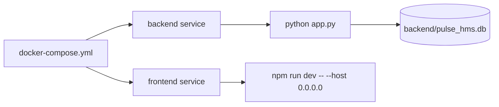

# Deployment Documentation

Last reviewed: 2026-05-16

This document describes the current deployment and runtime setup. It is development-oriented.

## Current Local Runtime

Manual backend:

```bash
cd backend
source venv/bin/activate
python app.py
```

Manual frontend:

```bash
cd frontend
npm install
npm run dev
```

Default URLs:

- Frontend: `http://localhost:5173`
- Backend: `http://localhost:5000`

## Docker Compose

`docker-compose.yml` defines two services:



Backend service:

- Build context: `./backend`
- Port: `5000:5000`
- Mount: `./backend:/app`
- Command: `python app.py`

Frontend service:

- Build context: `./frontend`
- Port: `5173:5173`
- Command: `npm run dev -- --host 0.0.0.0`

## Environment Variables

Root `.env.example`, `backend/.env.example`, and `frontend/.env.example` document current expected variables.

Backend:

- `SECRET_KEY`
- `JWT_SECRET_KEY`
- `DATABASE_URL`
- `CORS_ORIGINS`
- `FLASK_ENV`

Frontend:

- `VITE_API_URL`
- `VITE_SOCKET_URL`

## Build Commands

Backend dependency install:

```bash
cd backend
pip install -r requirements.txt
```

Frontend production build:

```bash
cd frontend
npm run build
```

## CI/CD

Current state:

- No CI configuration exists.
- No deployment pipeline exists.
- No automated test job exists.
- No migration check exists.

## Production Readiness Gaps

| Issue | Severity | Affected Modules | Probable Impact | Incremental Improvement | Difficulty |
| --- | --- | --- | --- | --- | --- |
| Docker uses dev servers | High | Dockerfiles, Compose | Not production safe | Add production backend server and static frontend serving | Medium |
| SQLite persistence | High | backend, database | Poor concurrency/recovery | Use managed PostgreSQL | Medium |
| No migrations | High | backend models | Unsafe schema evolution | Add Flask-Migrate/Alembic | Medium |
| Secrets default in code | Medium | backend config | Weak prod security if unset | Fail startup for missing prod secrets | Low |
| No CI/CD | High | repository | Manual regressions likely | Add GitHub Actions/GitLab CI | Low |
| No backup flow | High | database | Data loss risk | Document backup/restore for DB | Medium |
| No observability | Medium | runtime | Failures hard to diagnose | Add logs, Sentry, metrics | Medium |

