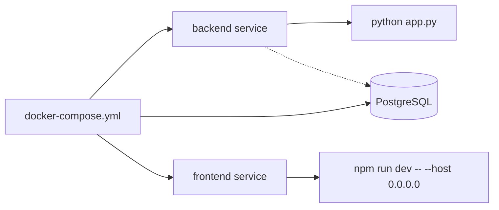
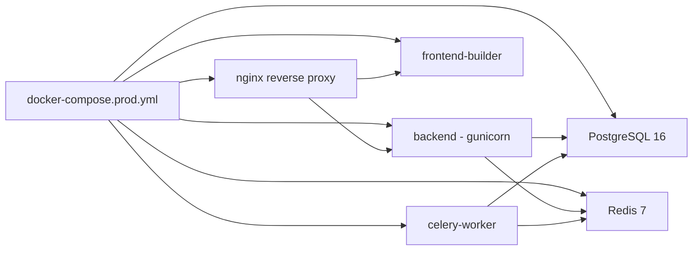

# Deployment Documentation

Last reviewed: 2026-06-20

This document describes the current deployment and runtime setup. Both development and production Docker Compose configurations are available.

## Current Local Runtime

Manual backend (development):

```bash
cd backend
source venv/bin/activate
python app.py
```

Manual frontend (development):

```bash
cd frontend
npm install
npm run dev
```

Default URLs:

- Frontend: `http://localhost:5173`
- Backend: `http://localhost:5000`

## Development Docker Compose

`docker-compose.yml` defines three services:



Backend service:

- Build context: `./backend`
- Port: `5000:5000`
- Mount: `./backend:/app`
- Command: `python app.py`
- Depends on: `db` (optional, falls back to SQLite if unavailable)

Database service:

- Image: `postgres:16-alpine`
- Port: `5432:5432`
- Default credentials: `pulse_user` / `pulse_pass`
- Database: `pulse_hms`
- Persistent volume: `pgdata`
- Health check via `pg_isready`

Frontend service:

- Build context: `./frontend`
- Port: `5173:5173`
- Command: `npm run dev -- --host 0.0.0.0`

## Production Docker Compose

`docker-compose.prod.yml` defines eight services:



| Service | Image/Config | Port | Purpose |
| --- | --- | --- | --- |
| `nginx` | `nginx:alpine` + `nginx.conf` | `80:80` | Reverse proxy, static files, WebSocket upgrade |
| `backend` | `backend/` → gunicorn | `5000:5000` | Flask WSGI via `wsgi:app` |
| `frontend-builder` | `frontend/` → nginx | Static | Builds assets, served by nginx |
| `db` | `postgres:16-alpine` | `5432` | Production database |
| `redis` | `redis:7-alpine` | `6379` | Celery broker, cache, rate limiting, socket message queue |
| `celery-worker` | `backend/` → celery | — | Background job processing |
| `prometheus` | `prom/prometheus:v2.55.0` | `9090` | Metrics collection |
| `grafana` | `grafana/grafana:11.2.0` | `3000` | Monitoring dashboards |

Production-specific configuration:

- gunicorn with configurable workers (default: 4)
- nginx caches static assets (1 year), proxies `/api/` + `/socket.io/` with WebSocket support
- Redis for Celery broker, Flask caching, rate limiting, and Socket.IO message queue
- Health check gating with `start_period` and `depends_on` conditions
- Environment validation via `Config.validate()` (requires `SECRET_KEY`, `JWT_SECRET_KEY` non-default in production)

## Environment Variables

Root `.env.example`, `backend/.env.example`, and `frontend/.env.example` document current expected variables.

Backend:

| Variable | Default | Purpose |
| --- | --- | --- |
| `SECRET_KEY` | `pulse-dev-secret` | Flask secret key |
| `JWT_SECRET_KEY` | `pulse-dev-jwt-secret` | JWT signing key |
| `DATABASE_URL` | `sqlite:///...` | SQLAlchemy connection string |
| `CORS_ORIGINS` | `http://localhost:5173` | Allowed browser origins |
| `FLASK_ENV` | — | Environment label |
| `AUTO_CREATE_TABLES` | `true` | Dev-only schema bootstrap toggle |
| `REDIS_URL` | — | Redis connection for Celery, cache, rate limit, socket |
| `STRIPE_SECRET_KEY` | — | Stripe API secret key |
| `STRIPE_PUBLISHABLE_KEY` | — | Stripe publishable key |
| `STRIPE_WEBHOOK_SECRET` | — | Stripe webhook signing secret |
| `TWILIO_ACCOUNT_SID` | — | Twilio account SID |
| `TWILIO_AUTH_TOKEN` | — | Twilio auth token |
| `TWILIO_PHONE_NUMBER` | — | Twilio sender phone number |
| `SENDGRID_API_KEY` | — | SendGrid API key |
| `FROM_EMAIL` | — | Email sender address |
| `SENTRY_DSN` | — | Sentry DSN for error tracking |
| `ENCRYPTION_KEY` | — | Fernet key for PII encryption |
| `UPLOAD_FOLDER` | `./uploads` | File upload destination |
| `RATELIMIT_ENABLED` | `true` | Enable rate limiting |
| `RATELIMIT_DEFAULT` | `200 per day;50 per hour` | Default rate limit |
| `LOG_FORMAT` | `text` | Log format: `text` or `json` |
| `GUNICORN_WORKERS` | `4` | Number of gunicorn worker processes |

Frontend:

| Variable | Default | Purpose |
| --- | --- | --- |
| `VITE_API_URL` | `http://localhost:5000/api/v1` | REST API base URL |
| `VITE_SOCKET_URL` | Derived from API URL | Socket.IO server URL |
| `VITE_SENTRY_DSN` | — | Sentry DSN for frontend error tracking |

## Build Commands

Backend dependency install:

```bash
cd backend
pip install -r requirements.txt
```

Frontend production build:

```bash
cd frontend
npm run build
```

Makefile targets:

```bash
make lint          # Run ruff + ESLint
make test          # Run pytest + frontend build
make build         # Build Docker images
make compose       # Start dev Docker Compose
make compose-prod-up   # Start production Docker Compose
make compose-prod-down # Stop production Docker Compose
make security-scan # Run security scanning
make freeze        # Update requirements.txt
make setup         # Install dependencies + seed database
make clean         # Remove Docker volumes + build artifacts
```

## CI/CD

Current state:

- GitHub Actions CI with 4 focused workflows on push/PR to main:
  - `lint-format.yml` — ruff check + ESLint
  - `test.yml` — pytest (54 tests) + frontend build
  - `security-scan.yml` — ruff security rules + pip-audit + Trivy
  - `docker-build.yml` — multi-stage Docker image build validation
- Backend: `py_compile` all Python files, `pytest` test suite (54 tests across 5 modules)
- Frontend: `npm run build` and `npm run lint` (0 errors, ~125 warnings)
- Migration check: `flask --app backend/app.py db -d backend/migrations check` (manual, not in CI)

## Production Readiness Gaps

| Issue | Severity | Affected Modules | Probable Impact | Incremental Improvement | Difficulty |
| --- | --- | --- | --- | --- | --- |
| SQLite default in dev | Medium | models, app, deployment | Poor concurrency and production resilience | Use PostgreSQL in production via DATABASE_URL | Medium |
| PostgreSQL optional in Compose | Medium | docker-compose.yml | Manual override needed for PG | Make PG required and env-configurable | Low |
| No backup flow | High | database | Data loss risk | Document backup/restore for DB | Medium |
| No migration check in CI | Medium | CI workflow | Migration VCS drift uncaught | Add `flask db check` to CI | Low |
| JWT in localStorage | Medium | frontend auth | XSS can expose token | Consider httpOnly cookies | Medium |
