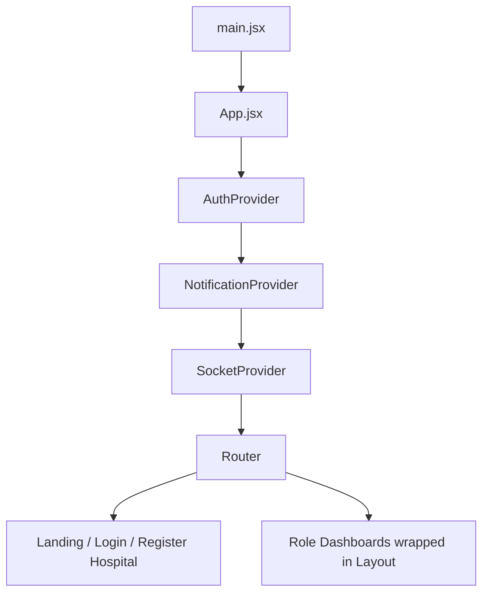
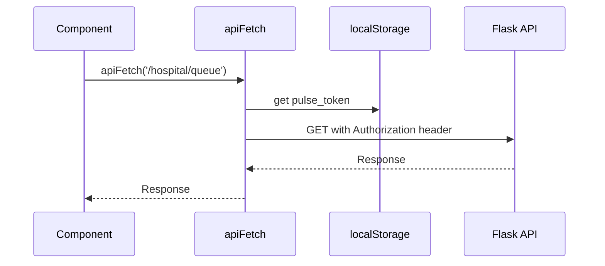

# Frontend Architecture

Last reviewed: 2026-05-16

The frontend is a React + Vite single-page app with role-specific dashboards, React Context providers, a small API helper, and Socket.IO client integration.

## Frontend Stack

- React 19
- Vite 8
- React Router 7
- Socket.IO client
- Lucide React icons
- Recharts
- jsPDF
- ESLint

## Folder Structure

```text
frontend/
  src/
    App.jsx
    main.jsx
    App.css
    index.css
    assets/
      hero.png
      react.svg
      vite.svg
    components/
      LandingPage.jsx
      LandingPage.css
      HospitalRegistration.jsx
      HospitalRegistration.css
      Login.jsx
      Layout.jsx
      PatientDashboard.jsx
      DoctorDashboard.jsx
      StaffDashboard.jsx
      AdminDashboard.jsx
      SuperAdminDashboard.jsx
    context/
      AuthContext.jsx
      NotificationContext.jsx
      SocketContext.jsx
    lib/
      api.js
  public/
  package.json
  vite.config.js
  Dockerfile
  .env.example
```

## Application Shell

`src/App.jsx` defines:

- Top-level providers:
  - `AuthProvider`
  - `NotificationProvider`
  - `SocketProvider`
- Browser router.
- Role-specific route guard.
- Light/dark theme state stored in `localStorage`.



## Routes

Defined in `App.jsx`:

| Path | Component | Access |
| --- | --- | --- |
| `/` | `LandingPage` or redirect | Public |
| `/login` | `Login` | Public |
| `/register-hospital` | `HospitalRegistration` | Public |
| `/patient` | `PatientDashboard` | `patient` |
| `/doctor` | `DoctorDashboard` | `doctor` |
| `/staff` | `StaffDashboard` | `staff` |
| `/admin` | `AdminDashboard` | `admin` |
| `/superadmin` | `SuperAdminDashboard` | `superadmin` |

Client-side route protection checks the saved `user.role`. The backend still performs authoritative checks.

## API Layer

`src/lib/api.js` centralizes API configuration.

Exports:

- `API_BASE_URL`
- `SOCKET_URL`
- `getAuthToken()`
- `apiUrl(path)`
- `apiFetch(path, options)`

`apiFetch`:

- Converts relative paths into full API URLs.
- Reads `pulse_token` from `localStorage`.
- Adds `Authorization: Bearer <token>` when available.
- Adds `Content-Type: application/json` when needed.
- Returns the raw `fetch` response so existing components can call `res.json()` and `res.ok`.



## Authentication State

`AuthContext.jsx` stores:

- `user`
- `token`
- `login(userData, jwtToken)`
- `logout()`

Persistent storage:

- `pulse_user`
- `pulse_token`

Login flow:

1. `Login.jsx` posts credentials to `/auth/login`.
2. Backend returns `token` and `user`.
3. `login(...)` saves data to React state and `localStorage`.
4. App redirects to `/${user.role}`.
5. `SocketProvider` connects because `user` is present.

## Socket State

`SocketContext.jsx`:

- Reads authenticated user from `AuthContext`.
- Creates a Socket.IO connection only when a user is logged in.
- Uses `SOCKET_URL`.
- Sends `auth: { token }` on connection.
- Provides the socket instance through context.

Dashboards listen for:

- `queue_updated`
- `appointment_booked`

Dashboards emit actions such as:

- `action_book_appointment`
- `action_arrive`
- `action_cancel_appointment`
- `action_submit_vitals`
- `action_prescribe_test`
- `action_pay_test`
- `action_upload_test_report`
- `action_prescribe_meds`
- `action_dispense_meds`

## Component Boundaries

### Public Components

- `LandingPage.jsx`: SaaS marketing/entry page with pricing buttons.
- `HospitalRegistration.jsx`: hospital workspace signup form.
- `Login.jsx`: login and patient signup form.

### Shared App Component

- `Layout.jsx`: sidebar, theme toggle, user identity, logout.

### Role Dashboards

- `PatientDashboard.jsx`: appointments, booking, profile, billing, prescriptions, labs, PDFs, ratings.
- `DoctorDashboard.jsx`: queue, stats, availability, notes, test orders, prescriptions.
- `StaffDashboard.jsx`: vitals queue, lab queue, pharmacy queue.
- `AdminDashboard.jsx`: analytics, user management, search.
- `SuperAdminDashboard.jsx`: currently mock platform tenant data.

## State Management

The frontend uses:

- React Context for auth, notification, and socket.
- Component-local `useState` for dashboard data.
- Component-local `useEffect` for fetching and socket subscriptions.
- `localStorage` for persistent auth and theme.

There is no global store, normalized cache, or server-state library.

## Data Flow By Dashboard

### Patient Dashboard

Fetches:

- `/patients/<id>/appointments`
- `/hospital/patient/<id>/tests`
- `/patients/<id>/prescriptions`
- `/auth/doctors`
- `/auth/doctors/all`
- `/hospital/patient/<id>/invoices`
- `/hospital/doctor/<doctor_id>/slots`
- `/hospital/appointment/<id>/summary`

Emits:

- `action_book_appointment`
- `action_cancel_appointment`
- `action_arrive`
- `action_pay_test`

### Doctor Dashboard

Fetches:

- `/hospital/doctor/<id>/queue`
- `/auth/admin/users`
- `/hospital/doctor/<id>/stats`
- `/hospital/doctor/<id>/availability`
- `/hospital/appointment/<id>/notes`

Emits:

- `action_prescribe_test`
- `action_prescribe_meds`

### Staff Dashboard

Fetches:

- `/hospital/queue`
- `/hospital/lab/queue`
- `/hospital/pharmacy/queue`

Emits:

- `action_submit_vitals`
- `action_upload_test_report`
- `action_dispense_meds`

### Admin Dashboard

Fetches/mutates:

- `/hospital/admin/analytics`
- `/auth/admin/users`
- `/auth/admin/users/<id>/deactivate`
- `/hospital/admin/search`

## Environment Variables

Frontend env variables are read by Vite and must use the `VITE_` prefix.

| Variable | Default | Purpose |
| --- | --- | --- |
| `VITE_API_URL` | `http://localhost:5000/api` | REST API base URL |
| `VITE_SOCKET_URL` | Derived from API URL | Socket.IO server URL |

## Build And Deployment

Scripts:

- `npm run dev`: starts Vite dev server.
- `npm run build`: builds static assets to `dist/`.
- `npm run lint`: runs ESLint.
- `npm run preview`: previews built assets.

Dockerfile:

- Uses `node:20-alpine`.
- Runs `npm ci`.
- Copies the frontend.
- Runs Vite dev server on `0.0.0.0`.

Docker Compose:

- Builds frontend image.
- Exposes `5173:5173`.
- Sets `VITE_API_URL` and `VITE_SOCKET_URL`.

The current container flow is development-oriented. It does not serve `dist/` through a production static server.

## Testing

Current frontend state:

- No frontend tests exist.
- No test runner is configured.
- Current validation is `npm run build` and `npm run lint`.
- Lint exits successfully but currently reports four React hook dependency warnings.

## Important Patterns

- All REST calls should use `apiFetch`, not direct `fetch`.
- Authenticated route UI checks happen in `ProtectedRoute`.
- Backend authorization is still the source of truth.
- Socket listeners are installed in dashboard `useEffect` hooks and removed on cleanup.
- PDF generation is done directly in `PatientDashboard.jsx`.
- Many component styles are inline, with shared CSS in `App.css`, `index.css`, and page-specific CSS.

## Frontend Weaknesses

Canonical detailed list: `docs/architectural-weaknesses.md`.

- `PatientDashboard.jsx` is large and owns many responsibilities.
- `AdminDashboard.jsx`, `DoctorDashboard.jsx`, and `StaffDashboard.jsx` also mix data fetching, UI, and workflow logic.
- No server-state library or caching layer exists.
- No form validation library exists.
- Auth token is stored in `localStorage`.
- Superadmin dashboard uses mock data.
- Role route guard has no loading/expired-token validation state.
- Hook dependency warnings remain in lint output.
- Production Docker flow still uses Vite dev server.
- No frontend tests exist.

## Suggested Frontend Improvements

- Split large dashboards into smaller feature components.
- Add route-level loaders or a server-state library such as TanStack Query.
- Add form validation with schemas.
- Add an authenticated session revalidation flow on app boot.
- Add an API error boundary and consistent toast/error handling.
- Move PDF generation into dedicated utilities.
- Add component and workflow tests.
- Replace mock superadmin UI with real APIs.
- Serve production builds with Nginx/Caddy or a static hosting platform.
