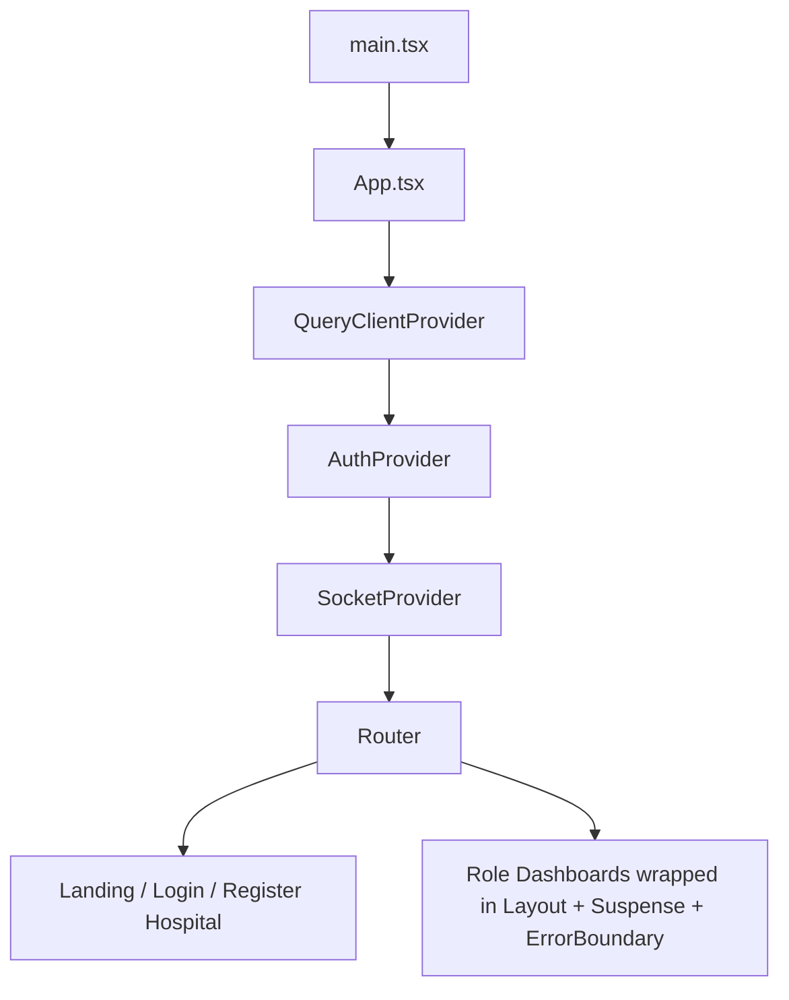
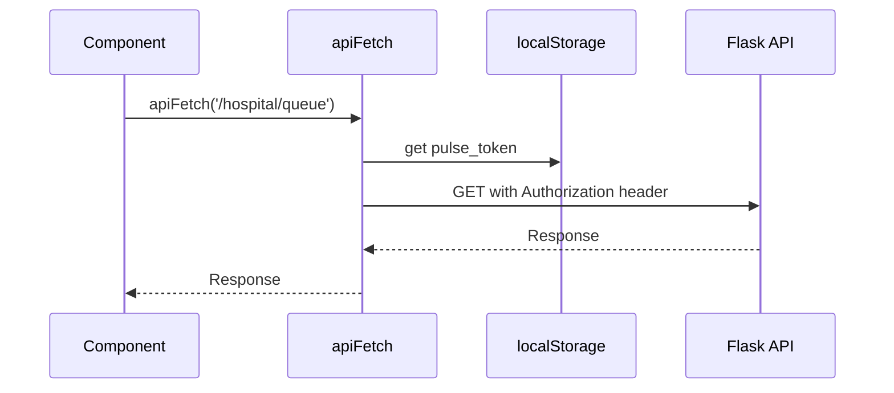

# Frontend Architecture

Last reviewed: 2026-06-19

The frontend is a React + Vite single-page app with role-specific dashboards, TanStack React Query caching, Zod form validation, Zustand client stores, React Context providers (auth/socket), and Socket.IO client integration.

## Frontend Stack

- React 19
- Vite 8 (with automatic code splitting via `React.lazy`)
- React Router 7
- TypeScript (all source files `.ts`/`.tsx`)
- TanStack React Query (server-state caching with typed wrappers)
- Zod + react-hook-form (form validation)
- Zustand (client state stores for notifications and theme)
- Socket.IO client
- Lucide React icons
- Recharts
- jsPDF
- ESLint (0 errors, ~127 warnings — all `@typescript-eslint/no-explicit-any`)
- Vitest + @testing-library/react (test framework)

## Folder Structure

```text
frontend/
  src/
    App.tsx                        # Top-level providers + routes
    main.tsx                       # Entry point
    index.css
    assets/
      hero.png
      react.svg
      vite.svg
    components/
      LandingPage.tsx
      LandingPage.css
      HospitalRegistration.tsx
      HospitalRegistration.css
      Login.tsx
      Layout.tsx
      ErrorBoundary.tsx
      NotificationRenderer.tsx
      PatientDashboard.tsx         # Orchestrator
      DoctorDashboard.tsx
      StaffDashboard.tsx
      AdminDashboard.tsx
      SuperAdminDashboard.tsx
      admin/
        AdminAnalyticsCharts.tsx
        AdminDeveloperPortal.tsx   # Phase 14 — API explorer
        AdminSearchPanel.tsx
        AdminStatsCards.tsx
        AdminUserManagement.tsx
      common/
        Skeleton.tsx               # DashboardSkeleton, StatCardSkeleton, Skeleton
        StatCard.tsx               # Shared stat card component
      doctor/
        DoctorActivePatientPanel.tsx
        DoctorQueuePanel.tsx
        DoctorStatsCards.tsx
      patient/
        ActiveAppointments.tsx     # Active visits with stepper progress
        ActiveLabTests.tsx         # Pending/payable lab tests
        MedicalHistory.tsx         # Past visits, ratings, prescriptions, labs
        PatientBilling.tsx         # Invoice table, pay, PDF download
        PatientProfile.tsx         # Profile form
        PatientBookingPanel.tsx    # Doctor listing + booking form
        RescheduleModal.tsx        # Date/slot reschedule modal
      staff/
        LabPanel.tsx
        PharmacyPanel.tsx
        VitalsPanel.tsx
      ui/
        Button.tsx                 # Reusable Button component
        Card.tsx                   # Reusable Card component
        Input.tsx                  # Reusable Input component
        Modal.tsx                  # Reusable Modal component
        index.ts                   # Barrel exports
    context/
      AuthContext.tsx
      SocketContext.tsx
    hooks/
      useApi.ts                    # Typed React Query wrappers (useApiQuery, useApiMutation)
      useDataFetch.ts              # Legacy GET fetch hook with loading/error state
      useSocketRefresh.ts          # Socket-driven cache invalidation
    lib/
      api.ts                       # apiFetch, apiJson, token management, refresh flow
      pdf.ts                       # PDF generation utilities
      schemas.ts                   # Zod schemas for forms
    stores/
      useNotificationStore.ts      # Zustand notification store (+ `notify` helper)
      useThemeStore.ts             # Zustand theme store (light/dark, localStorage)
    test/
      setup.js                     # Vitest setup
      StatCard.test.jsx            # StatCard component tests
      useNotificationStore.test.ts # Notification store tests
  public/
  package.json
  vite.config.ts
  tsconfig.json
  tsconfig.app.json
  tsconfig.node.json
  Dockerfile
  .env.example
```

## Application Shell

`src/App.tsx` defines:

- Top-level providers:
  - `QueryClientProvider` (TanStack React Query)
  - `AuthProvider`
  - `SocketProvider`
- `NotificationRenderer` — reads notifications from Zustand store, renders toast stack.
- Browser router.
- `ProtectedRoute` guard — checks `user` and `role` from `AuthContext`, wraps in `Layout`.
- Theme managed by `useThemeStore` (Zustand, persisted to `localStorage`), applied to `document.body.className`.
- `React.lazy` + `Suspense` for all role dashboards (code splitting per dashboard), wrapped in `ErrorBoundary`.
- `ReactQueryDevtools` in dev builds (bottom-left button).



## Routes

Defined in `App.tsx`:

| Path | Component | Access |
| --- | --- | --- |
| `/` | `LandingPage` or redirect | Public |
| `/login` | `Login` | Public |
| `/register-hospital` | `HospitalRegistration` | Public |
| `/patient` | `PatientDashboard` | `patient` |
| `/doctor` | `DoctorDashboard` | `doctor` |
| `/staff` | `StaffDashboard` | `staff` |
| `/admin` | `AdminDashboard` | `admin` |
| `/superadmin` | `SuperAdminDashboard` | `superadmin` |

Client-side route protection checks the saved `user.role`. The backend still performs authoritative checks.

## API Layer

`src/lib/api.ts` centralizes API configuration.

Exports:

- `API_BASE_URL` — defaults to `http://localhost:5000/api/v1`, reads `VITE_API_URL`.
- `SOCKET_URL` — derived from `API_BASE_URL` or `VITE_SOCKET_URL`.
- `apiUrl(path)` — resolves relative paths to full API URLs.
- `apiFetch(path, options)` — raw fetch wrapper with auto token injection, `Content-Type`, and 401 refresh flow.
- `apiJson<T>(path, options)` — typed JSON response wrapper over `apiFetch`, throws on error.
- `getAuthToken()`, `getRefreshToken()`, `setTokens()`, `clearTokens()` — token helpers.
- `setUnauthorizedHandler()` — registers callback for 401 after failed refresh.

Token refresh: on 401 with a refresh token present, `apiFetch` attempts a single silent refresh to `/auth/refresh`. If that succeeds, the original request retries. On failure, tokens are cleared and the unauthorized handler fires.



### Typed React Query Wrappers

`src/hooks/useApi.ts` provides typed wrappers around TanStack React Query:

- `useApiQuery<T>(key, url, options?)` — wraps `useQuery` with `apiFetch`, optional `transform`, configurable `staleTime` (default 30s) and `refetchInterval`.
- `useApiMutation<TData, TVariables>(urlOrFn, method, options?)` — wraps `useMutation` with `apiFetch`, auto error notification via `notify.error`, optional `invalidateKeys` for cache invalidation, optional `successMessage`.

## Authentication State

`AuthContext.tsx` stores:

- `user`
- `token`
- `login(userData, jwtToken)`
- `logout()`

Persistent storage:

- `pulse_user`
- `pulse_token`
- `pulse_refresh_token`

Login flow:

1. `Login.tsx` posts credentials to `/auth/login`.
2. Backend returns `token`, `refresh_token`, and `user`.
3. `login(...)` saves data to React state and `localStorage`.
4. App redirects to `/${user.role}`.
5. `SocketProvider` connects because `user` is present.

## Socket State

`SocketContext.tsx`:

- Reads authenticated user from `AuthContext`.
- Creates a Socket.IO connection only when a user is logged in.
- Uses `SOCKET_URL`.
- Sends `auth: { token }` on connection.
- Provides the socket instance through context.

Dashboards listen for:

- `queue_updated`
- `appointment_booked`
- `payment_processed` (AdminDashboard — refreshes analytics on payment)

Dashboards emit actions such as:

- `action_book_appointment`
- `action_arrive`
- `action_cancel_appointment`
- `action_submit_vitals`
- `action_prescribe_test`
- `action_pay_test`
- `action_upload_test_report`
- `action_prescribe_meds`
- `action_dispense_meds`

Socket-driven cache refresh is handled by `useSocketRefresh(socket, events, callback)` in `src/hooks/useSocketRefresh.ts`, which calls `queryClient.invalidateQueries()` when matching events fire.

## Component Boundaries

### Public Components

- `LandingPage.tsx`: SaaS marketing/entry page with pricing buttons.
- `HospitalRegistration.tsx`: hospital workspace signup form.
- `Login.tsx`: login and patient signup form.

### Shared App Components

- `Layout.tsx`: sidebar, theme toggle, user identity, logout.
- `ErrorBoundary.tsx`: error boundary wrapper.
- `NotificationRenderer.tsx`: toast notification stack (reads Zustand store).

### Shared UI Components (`components/ui/`)

- `Button.tsx`, `Input.tsx`, `Card.tsx`, `Modal.tsx` — reusable primitives with barrel exports from `index.ts`.

### Shared Data Components (`components/common/`)

- `StatCard.tsx`: metric display card used across dashboards.
- `Skeleton.tsx`: `DashboardSkeleton`, `StatCardSkeleton`, `Skeleton` for loading states.

### Role Dashboards

- `PatientDashboard.tsx`: appointments, booking, profile, billing, prescriptions, labs, PDFs, ratings.
- `DoctorDashboard.tsx`: queue, stats, availability, notes, test orders, prescriptions — sub-components in `doctor/`.
- `StaffDashboard.tsx`: vitals queue, lab queue, pharmacy queue — sub-components in `staff/`.
- `AdminDashboard.tsx`: analytics, user management, search, developer portal (Phase 14) — sub-components in `admin/`.
- `SuperAdminDashboard.tsx`: platform-wide hospital CRUD, plan management, stats — uses real API data via `useApiQuery`/`useApiMutation`.

## State Management

The frontend uses a layered approach:

- **TanStack React Query** — server-state (API data) with caching, background refetch, and invalidation via `queryClient.invalidateQueries()`.
- **Zustand stores** — client-only state:
  - `useNotificationStore` — toast notifications (with `notify.success`, `notify.error`, `notify.info`, `notify.warning` helpers).
  - `useThemeStore` — light/dark theme persisted to `localStorage`.
- **React Context** — auth (`AuthContext`) and socket (`SocketContext`). These are app-wide singletons that must not be stored in Zustand due to their dependency on React lifecycle and providers.

## Data Flow By Dashboard

### Patient Dashboard

Fetches:

- `/patients/<id>/appointments`
- `/hospital/patient/<id>/tests`
- `/patients/<id>/prescriptions`
- `/auth/doctors`
- `/auth/doctors/all`
- `/hospital/patient/<id>/invoices`
- `/hospital/doctor/<doctor_id>/slots`
- `/hospital/appointment/<id>/summary`

Emits:

- `action_book_appointment`
- `action_cancel_appointment`
- `action_arrive`
- `action_pay_test`

Mutation pattern: `useApiMutation` with `invalidateKeys` triggering query cache refresh. Socket-driven updates via `useSocketRefresh`.

### Doctor Dashboard

Fetches:

- `/hospital/doctor/<id>/queue`
- `/auth/admin/users`
- `/hospital/doctor/<id>/stats`
- `/hospital/doctor/<id>/availability`
- `/hospital/appointment/<id>/notes`

Emits:

- `action_prescribe_test`
- `action_prescribe_meds`

### Staff Dashboard

Fetches:

- `/hospital/queue`
- `/hospital/lab/queue`
- `/hospital/pharmacy/queue`

Emits:

- `action_submit_vitals`
- `action_upload_test_report`
- `action_dispense_meds`

### Admin Dashboard

Fetches/mutates:

- `/hospital/admin/analytics`
- `/auth/admin/users`
- `/auth/admin/users/<id>/deactivate`
- `/hospital/admin/search`
- `/hospital/admin/developer/...` (Phase 14 query/debug endpoints)

### SuperAdmin Dashboard

Fetches/mutates (via `useApiQuery`/`useApiMutation`):

- `/superadmin/hospitals`
- `/superadmin/hospitals/<id>/plan`
- `/superadmin/stats`
- `/superadmin/users`

## Environment Variables

Frontend env variables are read by Vite and must use the `VITE_` prefix.

| Variable | Default | Purpose |
| --- | --- | --- |
| `VITE_API_URL` | `http://localhost:5000/api/v1` | REST API base URL |
| `VITE_SOCKET_URL` | Derived from API URL | Socket.IO server URL |
| `VITE_SENTRY_DSN` | (empty) | Sentry error tracking DSN |

## Build And Deployment

Scripts (from `frontend/`):

- `npm run dev`: starts Vite dev server.
- `npm run build`: builds static assets to `dist/`.
- `npm run lint`: runs ESLint (0 errors, ~127 warnings — `@typescript-eslint/no-explicit-any`).
- `npm run typecheck`: runs `tsc --noEmit`.
- `npm run test`: runs Vitest test suite.
- `npm run preview`: previews built assets.

Dockerfile:

- Uses `node:20-alpine`.
- Runs `npm ci`.
- Copies the frontend.
- Runs Vite dev server on `0.0.0.0`.

Docker Compose:

- Builds frontend image.
- Exposes `5173:5173`.
- Sets `VITE_API_URL` and `VITE_SOCKET_URL`.

The current container flow is development-oriented. It does not serve `dist/` through a production static server. Production deployment uses the Docker Compose production stack (nginx in `docker-compose.prod.yml`).

## Testing

Frontend test suite:

- 11 tests across 2 files.
- Vitest configured with `@testing-library/react`.
- `src/test/setup.js` — test environment setup.
- `src/test/StatCard.test.jsx` — StatCard component tests.
- `src/test/useNotificationStore.test.ts` — notification store tests.

Testing gap: dashboards, forms, socket interactions, and API flows lack coverage. Testing priority is tenant isolation, role authorization, and workflow mutations.

## Important Patterns

- All REST calls should use `apiFetch` or `apiJson`, not direct `fetch`.
- Typed React Query wrappers (`useApiQuery`, `useApiMutation`) should be preferred over manual `useEffect` + `apiFetch` in components.
- `useMutation` with `invalidateKeys` auto-invalidates related query caches on success.
- Socket-driven updates use `useSocketRefresh(socket, events, callback)` which calls `queryClient.invalidateQueries()`.
- Authenticated route UI checks happen in `ProtectedRoute`.
- Backend authorization is still the source of truth.
- Zustand stores are imported directly — `useNotificationStore` for state, `notify` helper for cross-component toasts.
- Theme is managed via `useThemeStore` — call `toggleTheme()` or `setTheme()`, import `useThemeStore` directly.
- PDF generation utilities live in `src/lib/pdf.ts`.
- Zod schemas live in `src/lib/schemas.ts` — import into forms with `@hookform/resolvers` + `react-hook-form`.
- Shared UI primitives (`Button`, `Input`, `Card`, `Modal`) are imported from `../ui/`.
- Many component styles are inline, with shared CSS in `App.css`, `index.css`, and page-specific CSS files.

## Frontend Weaknesses

Canonical detailed list: `docs/architectural-weaknesses.md`.

- `AdminDashboard.tsx`, `DoctorDashboard.tsx`, and `StaffDashboard.tsx` still mix data fetching, UI, and workflow logic.
- Excessive `any` types remain in dashboard components (127 ESLint warnings).
- Auth token stored in `localStorage` (XSS vector — accept for dev).
- Role route guard has no loading/expired-token validation state.
- Production Docker flow still uses Vite dev server.
- Hardcoded color values in many components instead of CSS variables.
- Missing error states and empty-state UI in several components.
- Accessibility gaps — missing aria labels, keyboard navigation incomplete.
- Frontend test coverage is sparse (11 tests, dashboards untested).

## Suggested Frontend Improvements

- Extract remaining large dashboards (Admin/Doctor/Staff) into feature components.
- Add route-level loaders or error boundaries for each lazy-loaded dashboard.
- Add an authenticated session revalidation flow on app boot.
- Expand component and workflow tests (Vitest + @testing-library/react).
- Convert inline styles to CSS modules or Tailwind utility classes.
- Serve production builds with Nginx/Caddy or a static hosting platform.
